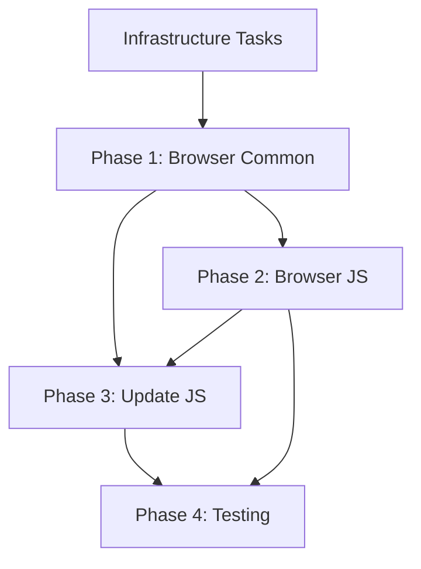

# Migration Task Coordination Document

## Overview

This document coordinates the development team's execution of the @signalwire/js package split migration plan. Each task is atomic, commitable, and testable.

## Task Status Legend

- 🔴 **Not Started**
- 🟡 **In Progress**
- 🟢 **Completed**
- 🔵 **Blocked**
- ⚪ **Under Review**

## Summary Dashboard

| Phase          | Total Tasks | Completed | In Progress | Blocked |
| -------------- | ----------- | --------- | ----------- | ------- |
| Infrastructure | 7           | 7         | 0           | 0       |
| Phase 1        | 12          | 12        | 0           | 0       |
| Phase 2        | 15          | 2         | 0           | 0       |
| Phase 3        | 8           | 0         | 0           | 0       |
| Phase 4        | 10          | 0         | 0           | 0       |
| **Total**      | **52**      | **21**    | **0**       | **0**   |

---

## Infrastructure Tasks (Prerequisites)

### INF-001: Update Root tsconfig.json Path Mappings

- **Status**: 🟢 Completed
- **Branch**: `feat/INF-001-tsconfig-path-mappings`
- **PR**: Not Created
- **Assignee**: TBD
- **Description**: Add path mappings for @signalwire/browser-common and @signalwire/browser-js
- **Test Plan**:
  - [x] TypeScript compilation works with new paths
  - [x] VSCode IntelliSense recognizes new packages
  - [x] No existing imports are broken
- **Dependencies**: None

### INF-002: Update NPM Workspaces Configuration

- **Status**: 🟢 Completed
- **Branch**: `feat/INF-002-npm-workspaces`
- **PR**: Not Created
- **Assignee**: TBD
- **Description**: Add packages/browser-common and packages/browser to workspaces in root package.json
- **Test Plan**:
  - [x] `npm install` recognizes new workspaces
  - [x] `npm list` shows correct dependency tree
  - [x] No npm warnings or errors
- **Dependencies**: None

### INF-003: Update sw-build-all Script

- **Status**: 🟢 Completed
- **Branch**: `feat/INF-003-build-order`
- **PR**: Not Created
- **Assignee**: TBD
- **Description**: Modify scripts/sw-build-all.js to build browser-common before browser-js and js
- **Test Plan**:
  - [x] Build order is: core → webrtc → browser-common → [browser-js, js]
  - [x] Parallel builds work correctly
  - [x] Build fails appropriately on errors
- **Dependencies**: INF-002

### INF-004: Create browser-common sw.config.js

- **Status**: 🟢 Completed
- **Branch**: `feat/INF-004-browser-common-config`
- **PR**: Not Created
- **Assignee**: TBD
- **Description**: Create build configuration for @signalwire/browser-common
- **Test Plan**:
  - [x] ESM build generates correctly
  - [x] CJS build generates correctly
  - [x] Type definitions are generated
- **Dependencies**: INF-002

### INF-005: Create browser-js sw.config.js

- **Status**: 🟢 Completed
- **Branch**: `feat/INF-005-browser-js-config`
- **PR**: Not Created
- **Assignee**: TBD
- **Description**: Create build configuration for @signalwire/browser-js with UMD support
- **Test Plan**:
  - [x] ESM, CJS, and UMD builds generate correctly
  - [x] UMD global is named 'SignalWire'
  - [x] External dependencies are properly configured
- **Dependencies**: INF-002

### INF-006: Update GitHub Actions Workflows

- **Status**: 🟢 Completed
- **Branch**: `feat/INF-006-github-actions`
- **PR**: Not Created
- **Assignee**: TBD
- **Description**: Update CI/CD workflows to test and build new packages
- **Test Plan**:
  - [x] CI runs tests for all packages
  - [x] Build artifacts are generated for new packages
  - [x] No regression in existing workflows
- **Dependencies**: INF-001, INF-002, INF-003

### INF-007: Setup Changesets for New Packages

- **Status**: 🟢 Completed
- **Branch**: `feat/INF-007-changesets`
- **PR**: Not Created
- **Assignee**: TBD
- **Description**: Configure changesets to handle version management for new packages
- **Test Plan**:
  - [x] Changesets recognize new packages
  - [x] Version bumps work correctly
  - [x] Release notes generation includes new packages
- **Dependencies**: INF-002

---

## Phase 1: Create Common Package

### P1-001: Create browser-common Package Structure

- **Status**: 🟢 Completed
- **Branch**: `feat/P1-001-browser-common-structure`
- **PR**: Not Created
- **Assignee**: TBD
- **Description**: Create packages/browser-common directory with package.json, tsconfig files, and jest config
- **Test Plan**:
  - [x] Package.json has correct name and dependencies
  - [x] TypeScript config extends root config properly
  - [x] Jest config works with test files
  - [x] README.md explains package purpose
- **Dependencies**: INF-001, INF-002, INF-004

### P1-002: Move BaseRoomSession to browser-common

- **Status**: 🟡 In Progress
- **Branch**: `feat/P1-002-move-base-room-session`
- **PR**: Not Created
- **Assignee**: TBD
- **Description**: Extract BaseRoomSession.ts from js package to browser-common/src
- **Test Plan**:
  - [ ] All BaseRoomSession tests pass in new location
  - [ ] No circular dependencies
  - [ ] Type exports work correctly
- **Dependencies**: P1-001

### P1-003: Move Client Classes to browser-common

- **Status**: 🟢 Completed
- **Branch**: `feat/P1-003-move-client-classes`
- **PR**: Not Created
- **Assignee**: TBD
- **Description**: Move Client.ts and JWTSession.ts to browser-common
- **Test Plan**:
  - [x] Client initialization tests pass
  - [x] JWT session management works
  - [x] WebSocket connection tests pass
- **Dependencies**: P1-001

### P1-004: Move RoomSession Components to browser-common

- **Status**: 🟢 Completed
- **Branch**: `feat/P1-003-move-client-classes` (shared with P1-003)
- **PR**: Not Created
- **Assignee**: TBD
- **Description**: Move RoomSessionDevice.ts and RoomSessionScreenShare.ts
- **Test Plan**:
  - [x] Device management tests pass
  - [x] Screen share functionality tests pass
  - [x] Event handling works correctly
- **Dependencies**: P1-002

### P1-005: Move Video Building Utilities

- **Status**: 🟢 Completed
- **Branch**: `feat/P1-005-move-video-utils`
- **PR**: Not Created
- **Assignee**: TBD
- **Description**: Move buildVideoElement.ts and VideoOverlays.ts
- **Test Plan**:
  - [x] Video element creation works
  - [x] Overlay functionality tests pass
  - [x] No DOM manipulation issues
- **Dependencies**: P1-001

### P1-006: Move Storage Utilities

- **Status**: 🟢 Completed
- **Branch**: `feat/P1-006-move-storage-utils`
- **PR**: Not Created
- **Assignee**: TBD
- **Description**: Move utils/storage.ts to browser-common
- **Test Plan**:
  - [x] LocalStorage operations work
  - [x] SessionStorage operations work
  - [x] Fallback mechanisms work when storage unavailable
- **Dependencies**: P1-001

### P1-007: Move Media Element Utilities

- **Status**: 🟢 Completed
- **Branch**: `feat/P1-007-move-media-utils`
- **PR**: Not Created
- **Assignee**: TBD
- **Description**: Move audioElement.ts and videoElement.ts utilities
- **Test Plan**:
  - [x] Audio element manipulation works
  - [x] Video element manipulation works
  - [x] Media stream attachment works
- **Dependencies**: P1-001

### P1-008: Move Common Utilities

- **Status**: 🟢 Completed
- **Branch**: `feat/P1-008-move-common-utils`
- **PR**: Not Created
- **Assignee**: TBD
- **Description**: Move constants.ts, CloseEvent.ts, makeQueryParamsUrl.ts, paginatedResult.ts
- **Test Plan**:
  - [x] Constants are accessible
  - [x] URL building works correctly
  - [x] Pagination utilities work (kept in fabric)
  - [x] CloseEvent handling works (already in browser-common)
- **Dependencies**: P1-001

### P1-009: Move Test Utilities

- **Status**: 🟢 Completed
- **Branch**: `feat/P1-009-move-test-utils`
- **PR**: Not Created
- **Assignee**: TBD
- **Description**: Move setupTests.ts and testUtils.ts to browser-common/src/test
- **Test Plan**:
  - [x] Test setup works in new location
  - [x] Mock utilities function correctly
  - [x] No test runner issues
- **Dependencies**: P1-001

### P1-010: Update js Package Imports

- **Status**: 🟢 Completed
- **Branch**: `feat/P1-010-update-js-imports`
- **PR**: Not Created
- **Assignee**: TBD
- **Description**: Update all imports in @signalwire/js to use @signalwire/browser-common
- **Test Plan**:
  - [x] All imports resolve correctly
  - [x] No TypeScript errors
  - [x] All js package tests pass
  - [x] Build succeeds
- **Dependencies**: P1-002 through P1-009

### P1-011: Add browser-common Dependency to js

- **Status**: 🟢 Completed
- **Branch**: `feat/P1-011-add-common-dependency`
- **PR**: Not Created
- **Assignee**: TBD
- **Description**: Update packages/js/package.json to depend on @signalwire/browser-common
- **Test Plan**:
  - [x] Dependency is properly declared
  - [x] npm install works
  - [x] No version conflicts
- **Dependencies**: P1-001

### P1-012: Verify browser-common Package

- **Status**: 🟢 Completed
- **Branch**: `feat/P1-012-verify-common-package`
- **PR**: Not Created
- **Assignee**: TBD
- **Description**: Run full test suite and build for browser-common
- **Test Plan**:
  - [x] All unit tests pass
  - [x] Build generates all formats
  - [x] Type definitions are correct
  - [x] Package can be imported successfully
- **Dependencies**: P1-001 through P1-011

---

## Phase 2: Create Browser Package

### P2-001: Create browser-js Package Structure

- **Status**: 🔴 Not Started
- **Branch**: `feat/P2-001-browser-js-structure`
- **PR**: Not Created
- **Assignee**: TBD
- **Description**: Verify packages/browser-js directory with initial package setup
- **Test Plan**:
  - [ ] Package.json configured correctly
  - [ ] TypeScript config works
  - [ ] Jest config functional
  - [ ] Build config generates all formats
- **Dependencies**: INF-005, P1-012

### P2-002: Create Type Utilities Module

- **Status**: 🟢 Completed
- **Branch**: `feat/P2-002-type-utilities`
- **PR**: Not Created
- **Assignee**: TBD
- **Description**: Create types/utilities.ts with Prettify, DeepPrettify, and other type helpers
- **Test Plan**:
  - [x] Type utilities compile correctly
  - [x] IDE shows expanded types properly
  - [x] No TypeScript errors
- **Dependencies**: P2-001

### P2-003: Move Fabric Directory Core

- **Status**: 🟢 Completed
- **Branch**: `feat/P2-003-move-fabric-core`
- **PR**: Not Created
- **Assignee**: TBD
- **Description**: Move SignalWire.ts, WSClient.ts, HTTPClient.ts from js/src/fabric to browser-js/src
- **Test Plan**:
  - [x] SignalWire client initialization works
  - [x] WebSocket connections establish
  - [x] HTTP requests function correctly
- **Dependencies**: P2-001

### P2-004: Rename FabricRoomSession to CallSession

- **Status**: 🟢 Completed
- **Branch**: `feat/P2-004-rename-call-session`
- **PR**: Not Created
- **Assignee**: TBD
- **Description**: Rename FabricRoomSession class to CallSession with all references
- **Test Plan**:
  - [x] Class renamed successfully
  - [x] All method references updated
  - [x] Event emitters use new name
  - [x] Tests updated and passing
- **Dependencies**: P2-003

### P2-005: Rename FabricRoomSessionMember to CallSessionMember

- **Status**: 🟢 Completed
- **Branch**: `feat/P2-005-rename-call-member`
- **PR**: Not Created
- **Assignee**: TBD
- **Description**: Rename FabricRoomSessionMember class to CallSessionMember
- **Test Plan**:
  - [x] Class renamed successfully
  - [x] Member list operations work
  - [x] Event handling updated
  - [x] Tests passing
- **Dependencies**: P2-004

### P2-006: Create Call Type Definitions

- **Status**: 🟢 Completed
- **Branch**: `feat/P2-006-call-types`
- **PR**: Not Created
- **Assignee**: TBD
- **Description**: Create types/call.ts with CallSession and CallMember prettified types
- **Test Plan**:
  - [ ] Types are properly exported
  - [ ] IDE shows clean interfaces
  - [ ] No type conflicts
  - [ ] JSDoc comments present
- **Dependencies**: P2-002, P2-004, P2-005

### P2-007: Create Event Type Definitions

- **Status**: 🟢 Completed
- **Branch**: `feat/P2-007-event-types`
- **PR**: Not Created
- **Assignee**: TBD
- **Description**: Create types/events.ts with all Call event types using Prettify
- **Test Plan**:
  - [ ] Event types are clean and readable
  - [ ] Event handlers type correctly
  - [ ] No any types leaked
- **Dependencies**: P2-002, P2-006

### P2-008: Create Legacy Type Adapters

- **Status**: 🟢 Completed
- **Branch**: `feat/P2-008-type-adapters`
- **PR**: Not Created
- **Assignee**: TBD
- **Description**: Create types/adapters.ts with Room→Call type mappings and deprecations
- **Test Plan**:
  - [ ] Legacy types map correctly
  - [ ] Deprecation warnings show in IDE
  - [ ] Backward compatibility maintained
- **Dependencies**: P2-006, P2-007

### P2-009: Move Fabric Workers

- **Status**: 🟢 Completed
- **Branch**: `feat/P2-009-move-workers`
- **PR**: Not Created
- **Assignee**: TBD
- **Description**: Move all fabric-related workers from js package
- **Test Plan**:
  - [x] Worker sagas function correctly
  - [x] Event handling works
  - [x] No Redux store issues
  - [x] All worker tests pass
- **Dependencies**: P2-003

### P2-010: Move IncomingCallManager

- **Status**: 🟢 Completed
- **Branch**: `feat/P2-010-incoming-call-manager`
- **PR**: Not Created
- **Assignee**: TBD
- **Description**: Move IncomingCallManager.ts to browser-js package
- **Test Plan**:
  - [x] Incoming call detection works
  - [x] Event firing correct
  - [x] Call answering functions
- **Dependencies**: P2-004

### P2-011: Move Conversation API

- **Status**: 🟢 Completed
- **Branch**: `feat/P2-011-conversation-api`
- **PR**: Not Created
- **Assignee**: TBD
- **Description**: Move conversation directory and all messaging functionality
- **Test Plan**:
  - [x] Message sending works
  - [x] Message receiving works
  - [x] Conversation history loads
  - [x] All conversation tests pass
- **Dependencies**: P2-003

### P2-012: Move Addresses API

- **Status**: 🟢 Completed
- **Branch**: `feat/P2-012-addresses-api`
- **PR**: Not Created
- **Assignee**: TBD
- **Description**: Move address resolution and management code
- **Test Plan**:
  - [x] Address lookup works
  - [x] Address validation functions
  - [x] Call routing works correctly
- **Dependencies**: P2-003

### P2-013: Setup Main Export File

- **Status**: 🟢 Completed
- **Branch**: `feat/P2-013-main-exports`
- **PR**: Not Created
- **Assignee**: TBD
- **Description**: Create src/index.ts with SignalWire and WebRTC namespaces
- **Test Plan**:
  - [x] SignalWire namespace exports correctly
  - [x] WebRTC utilities accessible
  - [x] All types exported at top level
  - [x] No circular dependencies
- **Dependencies**: P2-003 through P2-012

### P2-014: Add Dependencies and Build

- **Status**: 🟢 Completed
- **Branch**: `feat/P2-014-dependencies-build`
- **PR**: Not Created
- **Assignee**: TBD
- **Description**: Configure package.json dependencies and run full build
- **Test Plan**:
  - [x] All dependencies declared
  - [x] Build succeeds for all formats
  - [x] UMD bundle works in browser
  - [x] Package size is reasonable
- **Dependencies**: P2-001 through P2-013

### P2-015: Create browser-js Tests

- **Status**: 🟢 Completed
- **Branch**: `feat/P2-015-browser-js-tests`
- **PR**: Not Created
- **Assignee**: TBD
- **Description**: Ensure all moved code has appropriate test coverage
- **Test Plan**:
  - [ ] 85%+ code coverage
  - [ ] All unit tests pass
  - [ ] Integration tests work
  - [ ] No flaky tests
- **Dependencies**: P2-001 through P2-014

---

## Phase 3: Update Original Package

### P3-001: Remove Fabric Exports from index.ts

- **Status**: 🟢 Completed
- **Branch**: `feat/P3-001-remove-fabric-exports`
- **PR**: Not Created
- **Assignee**: TBD
- **Description**: Remove Fabric namespace and SignalWire exports from js/src/index.ts
- **Test Plan**:
  - [x] Fabric exports removed
  - [x] SignalWire export removed
  - [x] Only Video, Chat, PubSub, WebRTC remain
- **Dependencies**: P2-015

### P3-002: Add browser-js Dependency

- **Status**: 🟢 Completed
- **Branch**: `feat/P3-002-add-browser-dependency`
- **PR**: Not Created
- **Assignee**: TBD
- **Description**: Add @signalwire/browser-js as dependency for compatibility layer
- **Test Plan**:
  - [x] Dependency declared correctly
  - [x] Version constraints appropriate
  - [x] No circular dependencies
- **Dependencies**: P2-015

### P3-003: Create Deprecation Layer

- **Status**: 🟢 Completed
- **Branch**: `feat/P3-003-deprecation-layer`
- **PR**: Not Created
- **Assignee**: TBD
- **Description**: Re-export Fabric and SignalWire from browser-js with deprecation warnings
- **Test Plan**:
  - [ ] Imports still work
  - [ ] Console warnings appear
  - [ ] Types are properly forwarded
  - [ ] Migration message is clear
- **Dependencies**: P3-002

### P3-004: Remove Fabric Source Code

- **Status**: 🟢 Completed
- **Branch**: `feat/P3-004-remove-fabric-code`
- **PR**: Not Created
- **Assignee**: TBD
- **Description**: Delete fabric/ directory and all related code from js package
- **Test Plan**:
  - [ ] All fabric code removed
  - [ ] No broken imports
  - [ ] Build still succeeds
  - [ ] Video SDK unaffected
- **Dependencies**: P3-003

### P3-005: Remove Fabric Workers

- **Status**: 🔴 Not Started
- **Branch**: `feat/P3-005-remove-fabric-workers`
- **PR**: Not Created
- **Assignee**: TBD
- **Description**: Remove all fabric-related workers from js package
- **Test Plan**:
  - [ ] Fabric workers removed
  - [ ] No orphaned worker references
  - [ ] Redux store updated
- **Dependencies**: P3-004

### P3-006: Update js Package Tests

- **Status**: 🔴 Not Started
- **Branch**: `feat/P3-006-update-js-tests`
- **PR**: Not Created
- **Assignee**: TBD
- **Description**: Remove fabric tests and update remaining test suite
- **Test Plan**:
  - [ ] Fabric tests removed
  - [ ] Video tests still pass
  - [ ] Chat tests work
  - [ ] PubSub tests work
- **Dependencies**: P3-004, P3-005

### P3-007: Update js Package Documentation

- **Status**: 🔴 Not Started
- **Branch**: `feat/P3-007-update-docs`
- **PR**: Not Created
- **Assignee**: TBD
- **Description**: Update package README and inline documentation
- **Test Plan**:
  - [ ] README reflects Video SDK focus
  - [ ] API docs updated
  - [ ] Migration notice included
  - [ ] Examples updated
- **Dependencies**: P3-001 through P3-006

### P3-008: Verify js Package Build

- **Status**: 🔴 Not Started
- **Branch**: `feat/P3-008-verify-js-build`
- **PR**: Not Created
- **Assignee**: TBD
- **Description**: Run full build and test suite for updated js package
- **Test Plan**:
  - [ ] Build succeeds
  - [ ] All tests pass
  - [ ] Bundle size reduced
  - [ ] No runtime errors
- **Dependencies**: P3-001 through P3-007

---

## Phase 4: Testing & Validation

### P4-001: Update E2E Test Infrastructure

- **Status**: 🔴 Not Started
- **Branch**: `feat/P4-001-e2e-infrastructure`
- **PR**: Not Created
- **Assignee**: TBD
- **Description**: Update e2e-js test setup to support both packages
- **Test Plan**:
  - [ ] Test runner recognizes both packages
  - [ ] Import paths work correctly
  - [ ] Test utilities updated
- **Dependencies**: P3-008

### P4-002: Create Fabric SDK E2E Tests

- **Status**: 🔴 Not Started
- **Branch**: `feat/P4-002-fabric-e2e-tests`
- **PR**: Not Created
- **Assignee**: TBD
- **Description**: Port and update fabric tests to use @signalwire/browser-js
- **Test Plan**:
  - [ ] Call initiation tests pass
  - [ ] Call receiving tests work
  - [ ] Media handling tests pass
  - [ ] Error scenarios covered
- **Dependencies**: P4-001

### P4-003: Update Video SDK E2E Tests

- **Status**: 🔴 Not Started
- **Branch**: `feat/P4-003-video-e2e-tests`
- **PR**: Not Created
- **Assignee**: TBD
- **Description**: Ensure Video SDK tests still work with refactored package
- **Test Plan**:
  - [ ] Room joining works
  - [ ] Screen sharing functions
  - [ ] Member events fire correctly
  - [ ] Layout changes work
- **Dependencies**: P4-001

### P4-004: Update Playground Examples

- **Status**: 🔴 Not Started
- **Branch**: `feat/P4-004-playground-updates`
- **PR**: Not Created
- **Assignee**: TBD
- **Description**: Update playground-js to demonstrate both SDKs
- **Test Plan**:
  - [ ] Fabric examples use browser-js
  - [ ] Video examples use js
  - [ ] All examples run correctly
  - [ ] Clear separation of concerns
- **Dependencies**: P3-008

### P4-005: Test Backward Compatibility

- **Status**: 🔴 Not Started
- **Branch**: `feat/P4-005-backward-compatibility`
- **PR**: Not Created
- **Assignee**: TBD
- **Description**: Verify deprecation layer works for existing code
- **Test Plan**:
  - [ ] Old imports still work
  - [ ] Deprecation warnings show
  - [ ] No functional regression
  - [ ] Types resolve correctly
- **Dependencies**: P3-003

### P4-006: Performance Testing

- **Status**: 🔴 Not Started
- **Branch**: `feat/P4-006-performance-tests`
- **PR**: Not Created
- **Assignee**: TBD
- **Description**: Ensure no performance regression from refactoring
- **Test Plan**:
  - [ ] Bundle sizes documented
  - [ ] Load time measured
  - [ ] Runtime performance tested
  - [ ] Memory usage checked
- **Dependencies**: P3-008

### P4-007: Create Migration Guide

- **Status**: 🔴 Not Started
- **Branch**: `feat/P4-007-migration-guide`
- **PR**: Not Created
- **Assignee**: TBD
- **Description**: Write comprehensive migration guide for users
- **Test Plan**:
  - [ ] Clear upgrade path explained
  - [ ] Code examples provided
  - [ ] Common issues addressed
  - [ ] Published to docs site
- **Dependencies**: P3-008

### P4-008: Update API Documentation

- **Status**: 🔴 Not Started
- **Branch**: `feat/P4-008-api-documentation`
- **PR**: Not Created
- **Assignee**: TBD
- **Description**: Generate and update API docs for both packages
- **Test Plan**:
  - [ ] Docs generated successfully
  - [ ] All public APIs documented
  - [ ] Examples included
  - [ ] Cross-references work
- **Dependencies**: P3-008

### P4-009: Final Integration Testing

- **Status**: 🔴 Not Started
- **Branch**: `feat/P4-009-integration-testing`
- **PR**: Not Created
- **Assignee**: TBD
- **Description**: Run full integration test suite across all packages
- **Test Plan**:
  - [ ] All unit tests pass
  - [ ] All E2E tests pass
  - [ ] Cross-package imports work
  - [ ] No circular dependencies
- **Dependencies**: P4-001 through P4-008

### P4-010: Release Preparation

- **Status**: 🔴 Not Started
- **Branch**: `feat/P4-010-release-prep`
- **PR**: Not Created
- **Assignee**: TBD
- **Description**: Prepare packages for coordinated release
- **Test Plan**:
  - [ ] Changesets created
  - [ ] Version numbers set
  - [ ] CHANGELOGs updated
  - [ ] Release notes drafted
- **Dependencies**: P4-009

---

## Critical Path & Dependencies

## Parallel Work Opportunities

1. **After Infrastructure**: Multiple developers can work on different P1 tasks
2. **Phase 2 & 3**: Can partially overlap once core moves are complete
3. **Within Phase 2**: Type creation can happen in parallel with code moves
4. **Testing**: E2E tests can be prepared while implementation ongoing

## Risk Mitigation

1. **Blocking Issues**: Any INF task blocks everything - prioritize these
2. **Type Safety**: P2-002 (type utilities) is critical for clean API
3. **Backward Compatibility**: P3-003 must be thoroughly tested
4. **Build System**: INF-003 failure would block all development

## Notes for Developers

1. **Branch Naming**: Use format `feat/PHASE-###-description`
2. **Commits**: Make atomic commits with descriptive messages
3. **Testing**: Write tests before moving code when possible
4. **Reviews**: Tag relevant team members based on expertise
5. **Documentation**: Update inline docs as you work
6. **Status Updates**: Update this document daily with progress

## Weekly Sync Points

- **Monday**: Review blocking issues and dependencies
- **Wednesday**: Progress check and reallocation if needed
- **Friday**: Test suite status and integration check

---

Last Updated: [To be filled by team lead]
Next Review: [To be filled by team lead]
