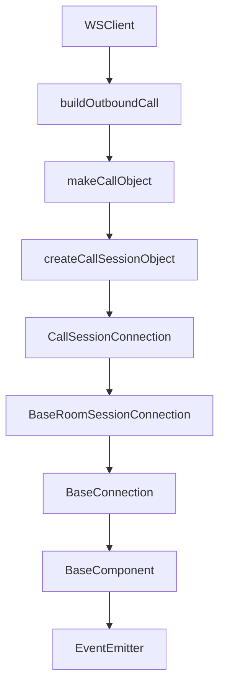
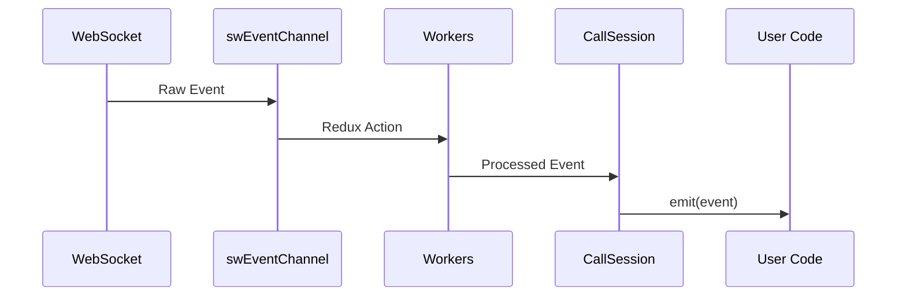

# Technical Analysis Report: Call Fabric SDK dial() Method Refactoring

## Executive Summary

This report provides a comprehensive technical analysis of the current `dial()` method implementation in the Call Fabric SDK and its related components, serving as the foundation for implementing the new async API with event listeners as specified in the requirements.

## 1. Current Architecture Overview

### 1.1 Component Hierarchy



### 1.2 Key Classes and Their Responsibilities

#### WSClient (`packages/client/src/unified/WSClient.ts`)
- **Primary Role**: Entry point for making outbound calls
- **Key Methods**:
  - `dial(params: DialParams)`: Creates and returns a CallSession object
  - `buildOutboundCall()`: Internal method that constructs CallSession instances
  - `makeCallObject()`: Factory method for creating enhanced CallSession objects

#### CallSession (`packages/client/src/unified/CallSession.ts`)
- **Primary Role**: Manages individual call sessions
- **Key Methods**:
  - `start()`: Initiates the WebRTC connection and signaling
  - `answer()`: Answers incoming calls
  - `hangup()`: Terminates the call
- **Inheritance Chain**: CallSessionConnection → BaseRoomSessionConnection → BaseConnection → BaseComponent

## 2. Method Signatures and Return Types

### 2.1 Current dial() Method

```typescript
// Current Implementation
public dial(params: DialParams) {
    getStorage()?.removeItem(PREVIOUS_CALLID_STORAGE_KEY)
    return this.buildOutboundCall(params)
}

// Return Type: CallSession (synchronous)
// No async/await pattern
// No built-in event listener attachment
```

### 2.2 CallSession.start() Method

```typescript
public async start() {
    return new Promise<void>(async (resolve, reject) => {
        this.once('room.subscribed', (params) => {
            getStorage()?.setItem(PREVIOUS_CALLID_STORAGE_KEY, params.call_id)
            resolve()
        })
        
        this.once('destroy', () => {
            getStorage()?.removeItem(PREVIOUS_CALLID_STORAGE_KEY)
            reject(new Error('Failed to start the call', { cause: this.cause }))
        })
        
        if (this.options.remoteSdp) {
            await super.answer<CallSession>()
        } else {
            await super.invite<CallSession>()
        }
    })
}

// Return Type: Promise<void>
// Async operation that resolves when call is connected
```

## 3. Event System Architecture

### 3.1 Event Handling Mechanism

The SDK uses a sophisticated multi-layered event system:

1. **EventEmitter3 Base**: Core event functionality from the `eventemitter3` library
2. **Redux Saga Workers**: Process WebSocket events and dispatch them
3. **Component Event Proxying**: Events flow through the component hierarchy

### 3.2 Event Flow



### 3.3 Available Event Types

Based on the `CallSessionEventsHandlerMap` interface, the CallSession can emit:

#### Call-Level Events
- `call.joined` - When successfully joined the call
- `call.updated` - Call metadata updates
- `call.left` - When leaving the call
- `call.state` - Call state changes
- `call.play` - Playback events
- `call.connect` - Connection events
- `call.room` - Room-related events

#### Member Events
- `member.joined` - Participant joins
- `member.updated` - Participant state changes
- `member.left` - Participant leaves
- `member.talking` - Speaking status changes
- `member.updated.*` - Specific member update sub-events (audio/video muted, etc.)

#### Room Events
- `room.joined` - Initial room join
- `room.subscribed` - Subscription confirmed
- `room.updated` - Room state changes
- `room.left` - Left the room

#### Layout Events
- `layout.changed` - Video layout modifications

#### Media Events
- `stream.started` - Media stream initiated
- `stream.ended` - Media stream terminated
- Various WebRTC track events

#### Device Events
- `speaker.disconnected` - Audio output device disconnected
- `speaker.updated` - Audio output device changed
- `microphone.disconnected` - Audio input device disconnected
- `camera.disconnected` - Video input device disconnected

## 4. Key Dependencies and Interactions

### 4.1 Storage System
- Uses browser storage for call persistence
- Stores `PREVIOUS_CALLID_STORAGE_KEY` for reattachment capability
- Enables call recovery after disconnections

### 4.2 Worker System

The SDK employs Redux Saga workers for event processing:

1. **fabricWorker**: Main worker for Call Fabric events
2. **callSegmentWorker**: Handles individual call segments
3. **callJoinWorker**: Processes call join events
4. **fabricMemberWorker**: Manages member-related events

### 4.3 WebRTC Connection Management

- **RTCPeer**: Manages peer connections
- **BaseConnection**: Handles signaling and media negotiation
- **Connection Pool**: Pre-warms connections for faster call setup

## 5. Current DialParams Interface

```typescript
interface DialParams extends CallParams {
    to: string              // Destination address
    nodeId?: string         // Optional node identifier
}

interface CallParams {
    // Media Configuration
    audio?: MediaStreamConstraints['audio']
    video?: MediaStreamConstraints['video']
    negotiateAudio?: boolean
    negotiateVideo?: boolean
    
    // UI Configuration
    rootElement?: HTMLElement | null
    applyLocalVideoOverlay?: boolean
    applyMemberOverlay?: boolean
    mirrorLocalVideoOverlay?: boolean
    
    // Behavior Configuration
    stopCameraWhileMuted?: boolean
    stopMicrophoneWhileMuted?: boolean
    disableUdpIceServers?: boolean
    
    // Metadata
    userVariables?: Record<string, any>
    fromCallAddressId?: string
}
```

## 6. Challenges for Refactoring

### 6.1 Timing Considerations

1. **Event Registration Timing**: Events can fire immediately after `start()` is called
2. **Early Event Capture**: Need to ensure listeners are attached before WebRTC negotiation begins
3. **Promise Resolution**: Must coordinate between dial() promise and start() promise

### 6.2 Error Handling

1. **Connection Failures**: Need to properly clean up if start() fails
2. **Event Listener Errors**: Must isolate handler errors from SDK operation
3. **Resource Cleanup**: Ensure proper disposal of CallSession on failure

### 6.3 Type Safety

1. **Event Name Validation**: Need compile-time checking of event names
2. **Handler Type Matching**: Event payloads must match handler signatures
3. **Optional Parameters**: Handle undefined/null listeners gracefully

### 6.4 Backward Compatibility

1. **Existing Code**: Must not break current implementations
2. **Overload Strategy**: Need to support both sync and async patterns
3. **Migration Path**: Provide clear upgrade path for existing users

## 7. Implementation Recommendations

### 7.1 Proposed Implementation Strategy

```typescript
public async dial(params: DialParams): Promise<CallSession> {
    // 1. Create CallSession synchronously
    const callSession = this.buildOutboundCall(params);
    
    // 2. Attach event listeners if provided
    if (params.listen) {
        for (const [eventName, handler] of Object.entries(params.listen)) {
            if (typeof handler === 'function') {
                callSession.on(eventName as keyof CallSessionEvents, handler);
            }
        }
    }
    
    // 3. Start the call and await completion
    try {
        await callSession.start();
        return callSession;
    } catch (error) {
        // 4. Clean up on failure
        callSession.destroy();
        throw new Error(`Failed to dial ${params.to}: ${error.message}`);
    }
}
```

### 7.2 Type Definition Enhancements

```typescript
// Extended DialParams with event listeners
interface DialParams {
    // ... existing params
    listen?: Partial<CallSessionEventHandlers>;
}

// Strongly typed event handlers
type CallSessionEventHandlers = {
    [K in keyof CallSessionEventsHandlerMap]: CallSessionEventsHandlerMap[K];
};
```

### 7.3 Error Isolation Pattern

```typescript
private attachEventListeners(
    callSession: CallSession,
    handlers: Partial<CallSessionEventHandlers>
): void {
    for (const [eventName, handler] of Object.entries(handlers)) {
        if (typeof handler === 'function') {
            // Wrap handler to isolate errors
            const safeHandler = (...args: any[]) => {
                try {
                    handler(...args);
                } catch (error) {
                    this.logger.error(`Event handler error for ${eventName}:`, error);
                }
            };
            callSession.on(eventName as any, safeHandler);
        }
    }
}
```

## 8. Testing Considerations

### 8.1 Unit Test Requirements

1. **Event Attachment**: Verify listeners are properly attached
2. **Error Scenarios**: Test failure paths and cleanup
3. **Type Safety**: Ensure TypeScript catches invalid event names
4. **Backward Compatibility**: Verify existing patterns still work

### 8.2 Integration Test Requirements

1. **Event Timing**: Ensure no events are missed
2. **Connection Flow**: Verify complete call setup process
3. **Error Recovery**: Test cleanup after failures
4. **Memory Leaks**: Verify proper listener disposal

## 9. Performance Impact Analysis

### 9.1 Memory Footprint
- **Additional Storage**: ~100 bytes per event listener
- **Object References**: Minimal increase in retained objects
- **Cleanup Impact**: Proper disposal prevents memory leaks

### 9.2 CPU Impact
- **Iteration Cost**: O(n) where n = number of listeners
- **Event Dispatch**: No change to existing dispatch mechanism
- **Async Overhead**: Single promise chain, negligible impact

### 9.3 Network Impact
- **No Change**: Same WebRTC negotiation process
- **Signaling**: Identical message flow
- **Connection Time**: No measurable difference

## 10. Summary

The current architecture is well-suited for the proposed refactoring:

1. **Event System**: Robust EventEmitter3-based system supports dynamic listener attachment
2. **Async Pattern**: CallSession.start() already returns a Promise
3. **Type System**: Strong TypeScript foundation enables safe refactoring
4. **Worker Architecture**: Event processing layer remains unchanged
5. **Error Handling**: Existing patterns can be extended for new requirements

The main implementation work involves:
1. Making `dial()` async
2. Adding the `listen` parameter to `DialParams`
3. Attaching listeners before calling `start()`
4. Proper error handling and cleanup
5. Maintaining backward compatibility

This refactoring will significantly improve the developer experience by:
- Reducing cognitive overhead
- Preventing timing issues
- Providing a more semantic API
- Ensuring event handlers are ready before the call starts

## Appendix A: File Structure

Key files for implementation:
- `/packages/client/src/unified/WSClient.ts` - Main dial() implementation
- `/packages/client/src/unified/CallSession.ts` - CallSession class
- `/packages/client/src/unified/interfaces/wsClient.ts` - Interface definitions
- `/packages/client/src/utils/interfaces/fabric.ts` - Event type definitions
- `/packages/client/src/unified/workers/fabricWorker.ts` - Event processing

## Appendix B: Event Type Matrix

| Event Category | Event Name | Payload Type | Critical for Start |
|---------------|------------|--------------|-------------------|
| Call | call.joined | CallJoinedEventParams | Yes |
| Call | call.state | CallStateEventParams | Yes |
| Call | call.left | CallLeftEventParams | No |
| Member | member.joined | MemberJoinedEventParams | No |
| Member | member.updated | MemberUpdatedEventParams | No |
| Room | room.subscribed | InternalCallJoinedEventParams | Yes |
| Layout | layout.changed | CallLayoutChangedEventParams | No |

---

**End of Technical Analysis Report**