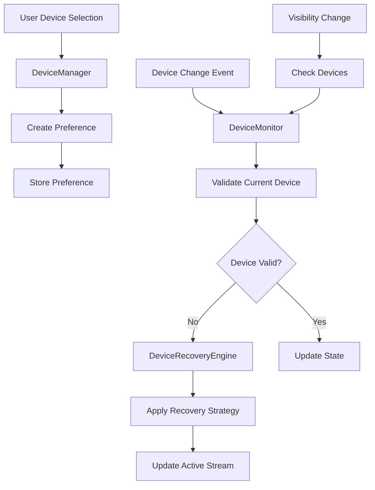
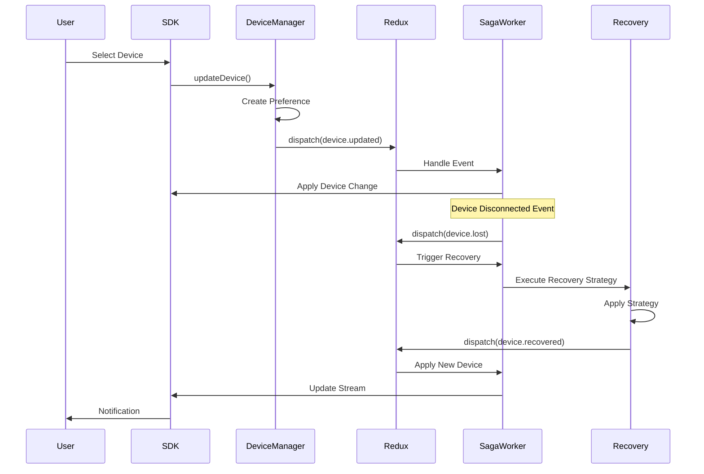

# Device Preference Management - Technical Specification

## 1. Feature Overview

Device Preference Management provides sophisticated handling of audio/video device selection, persistence, and automatic recovery when devices are disconnected or reconnected. This feature extracts and enhances the device management capabilities introduced in the Cantina app (PR #1509) to provide a robust device handling system for the @signalwire/client SDK.

### Key Capabilities

- **Device Preference Tracking**: Remember user's specific device selections vs. OS default preferences
- **Automatic Device Recovery**: Intelligently recover from device disconnections with fallback strategies
- **OS Default Monitoring**: Track actual devices when "OS Default" is selected
- **Real-time Device Change Detection**: Monitor and respond to device changes during active calls
- **Smart Fallback Logic**: Priority-based recovery (exact ID → label match → same type → OS default)

## 2. Problem Statement

### Current Limitations

1. **Device Loss**: When a device is disconnected, the SDK doesn't automatically recover or fallback
2. **No Preference Memory**: Device selections are not persisted or remembered across sessions
3. **Limited Recovery Options**: No intelligent fallback when preferred device is unavailable
4. **OS Default Tracking**: When using OS default, the actual device in use is not tracked
5. **Poor User Experience**: Users must manually reselect devices after disconnection/reconnection

### User Impact

- Calls fail or have no audio/video when devices are disconnected
- Users must repeatedly configure devices after system changes
- No seamless experience when switching between different audio devices
- Confusion when OS default device changes without notification

## 3. Proposed Solution

### Core Components

#### 3.1 Device Preference Model

```typescript
interface DevicePreference {
  isDefault: boolean // User selected OS default vs specific device
  preferredLabel?: string // Label of the specific device selected
  lastSeenId?: string // Last known device ID for this label
  fallbackStrategy?: 'default' | 'none' | 'same-type'
}

interface DeviceState {
  currentId: string
  currentLabel?: string
  preference?: DevicePreference
  actualDefaultId?: string // Actual device when using OS default
}
```

#### 3.2 Device Recovery Strategy

1. **Exact ID Match**: Try to use the same device ID
2. **Label Match**: Find device with same label (handles ID changes)
3. **Same Type Fallback**: Use first available device of same type
4. **OS Default Fallback**: Fall back to system default
5. **None**: Disable device if no alternatives found

#### 3.3 Monitoring System

- Continuous device enumeration monitoring
- Visibility/focus change detection
- Network quality monitoring for media issues
- Automatic reinvite triggers for recovery

## 4. Technical Architecture

### 4.1 Component Hierarchy

```
BaseRoomSession
  ├── DeviceManager (new)
  │   ├── DevicePreferenceStore
  │   ├── DeviceMonitor
  │   └── DeviceRecoveryEngine
  ├── BaseConnection
  └── Existing Components
```

### 4.2 Data Flow



### 4.3 Event Flow



## 5. API Design

### 5.1 Configuration

#### DevicePreferenceConfig Interface

```typescript
interface DevicePreferenceConfig {
  enabled?: boolean // Enable device preference management (default: false)
  autoRecovery?: boolean // Enable automatic device recovery (default: true when enabled)
  persistPreferences?: boolean // Persist preferences to storage (default: false)
  monitoringInterval?: number // Device polling interval in ms (default: 2000)
  enableNativeEvents?: boolean // Use native devicechange events (default: true)
  recoveryStrategy?: RecoveryStrategy // Custom recovery strategy
  storageAdapter?: StorageAdapter // Custom storage implementation
}

// Session-level configuration
interface BaseRoomSessionOptions {
  devicePreferences?: DevicePreferenceConfig
  // ... existing options
}
```

### 5.2 Public Methods

#### DeviceManager Class

```typescript
class DeviceManager {
  // Runtime configuration
  enable(config?: Partial<DevicePreferenceConfig>): void
  disable(): void
  isEnabled(): boolean
  updateConfig(config: Partial<DevicePreferenceConfig>): void

  // Set device with preference tracking
  async setCamera(deviceId: string, options?: DeviceOptions): Promise<void>
  async setMicrophone(deviceId: string, options?: DeviceOptions): Promise<void>
  async setSpeaker(deviceId: string, options?: DeviceOptions): Promise<void>

  // Get current devices with preferences
  getCamera(): DeviceState
  getMicrophone(): DeviceState
  getSpeaker(): DeviceState

  // Recovery control
  setRecoveryStrategy(strategy: RecoveryStrategy): void
  enableAutoRecovery(enabled: boolean): void

  // Monitoring control
  startMonitoring(): void
  stopMonitoring(): void

  // Manual recovery trigger
  async recoverDevices(): Promise<RecoveryResult>
}
```

#### Integration with BaseRoomSession

```typescript
interface BaseRoomSession {
  // New device manager property (lazily initialized if config.devicePreferences.enabled)
  readonly deviceManager?: DeviceManager

  // Enhanced existing methods
  updateCamera(
    constraints: CameraConstraints & { preference?: DevicePreference }
  ): Promise<void>
  updateMicrophone(
    constraints: MicrophoneConstraints & { preference?: DevicePreference }
  ): Promise<void>
  updateSpeaker(deviceId: string, preference?: DevicePreference): Promise<void>
}
```

### 5.3 Events

```typescript
interface DeviceManagerEvents {
  // Device state changes
  'device.changed': {
    type: 'camera' | 'microphone' | 'speaker'
    device: DeviceState
  }
  'device.recovered': {
    type: string
    from: string
    to: string
    strategy: string
  }
  'device.lost': { type: string; device: DeviceState }

  // Recovery events
  'recovery.started': { devices: string[] }
  'recovery.completed': { results: RecoveryResult[] }
  'recovery.failed': { device: string; error: Error }

  // OS default changes
  'default.changed': { type: string; from: string; to: string }
}
```

### 5.4 Interfaces

```typescript
interface DeviceOptions {
  preference?: DevicePreference
  persist?: boolean
  notifyOnChange?: boolean
}

interface RecoveryStrategy {
  priority: ('exact' | 'label' | 'same-type' | 'default')[]
  fallbackToNone?: boolean
  autoRecover?: boolean
  debounceMs?: number
}

interface RecoveryResult {
  device: string
  recovered: boolean
  strategy?: string
  fallback?: boolean
  error?: Error
}
```

## 6. Implementation Details

### 6.1 DeviceManager Implementation

```typescript
export class DeviceManager extends EventEmitter<DeviceManagerEvents> {
  private devices: Map<DeviceType, DeviceState> = new Map()
  private preferences: Map<DeviceType, DevicePreference> = new Map()
  private monitor: DeviceMonitor
  private recovery: DeviceRecoveryEngine
  private storage: DevicePreferenceStorage

  constructor(private session: BaseRoomSession) {
    super()
    this.monitor = new DeviceMonitor()
    this.recovery = new DeviceRecoveryEngine()
    this.storage = new DevicePreferenceStorage()

    this.initializeEventHandlers()
    this.loadStoredPreferences()
  }

  private initializeEventHandlers(): void {
    // Monitor device changes
    this.monitor.on('device.added', this.handleDeviceAdded.bind(this))
    this.monitor.on('device.removed', this.handleDeviceRemoved.bind(this))
    this.monitor.on('device.changed', this.handleDeviceChanged.bind(this))

    // Handle visibility changes
    document.addEventListener(
      'visibilitychange',
      this.handleVisibilityChange.bind(this)
    )

    // Handle focus changes
    window.addEventListener('focus', this.handleFocusGain.bind(this))
    window.addEventListener('blur', this.handleFocusLoss.bind(this))
  }

  async setCamera(deviceId: string, options?: DeviceOptions): Promise<void> {
    const preference = this.createPreference(deviceId, options)

    // Validate device exists
    const validated = await this.validateDevice('camera', deviceId)
    if (!validated) {
      throw new Error(`Camera device ${deviceId} not found`)
    }

    // Update state
    this.devices.set('camera', {
      currentId: validated.deviceId,
      currentLabel: validated.label,
      preference,
      actualDefaultId:
        deviceId === 'default'
          ? await this.getActualDefault('camera')
          : undefined,
    })

    // Store preference if requested
    if (options?.persist) {
      await this.storage.save('camera', preference)
    }

    // Dispatch Redux action for saga workers
    this.session.dispatch(
      deviceActions.preferenceUpdated({
        type: 'camera',
        preference,
      })
    )

    // Apply to session (this will trigger RPC to server)
    await this.session.updateCamera({ deviceId: validated.deviceId })

    // Emit public event for applications
    this.emit('device.changed', {
      type: 'camera',
      device: this.devices.get('camera')!,
    })
  }

  private async handleDeviceRemoved(event: DeviceChangeEvent): Promise<void> {
    for (const [type, state] of this.devices.entries()) {
      if (state.currentId === event.deviceId) {
        // Dispatch Redux action to trigger recovery in saga worker
        this.session.dispatch(
          deviceActions.deviceLost({
            type,
            deviceId: event.deviceId,
          })
        )

        // Also dispatch recovery needed action
        this.session.dispatch(
          deviceActions.recoveryNeeded({
            type,
            currentId: state.currentId,
            preference: state.preference,
          })
        )

        // Note: Actual recovery will be handled by saga worker
        // which will call applyRecoveredDevice when successful
      }
    }
  }

  private async applyRecoveredDevice(
    type: DeviceType,
    result: RecoveryResult
  ): Promise<void> {
    const state = this.devices.get(type)!

    // Update state with recovered device
    state.currentId = result.deviceId
    state.currentLabel = result.label

    // Apply to session
    switch (type) {
      case 'camera':
        await this.session.updateCamera({ deviceId: result.deviceId })
        break
      case 'microphone':
        await this.session.updateMicrophone({ deviceId: result.deviceId })
        break
      case 'speaker':
        await this.session.updateSpeaker(result.deviceId)
        break
    }

    // Emit recovery event
    this.emit('device.recovered', {
      type,
      from: state.currentId,
      to: result.deviceId,
      strategy: result.strategy || 'unknown',
    })
  }
}
```

### 6.2 DeviceMonitor Implementation

```typescript
class DeviceMonitor extends EventEmitter {
  private previousDevices: Map<string, MediaDeviceInfo> = new Map()
  private monitoringInterval?: NodeJS.Timer
  private isMonitoring = false

  start(): void {
    if (this.isMonitoring) return

    this.isMonitoring = true
    this.startPolling()
    this.attachNativeListeners()
  }

  stop(): void {
    this.isMonitoring = false
    this.stopPolling()
    this.detachNativeListeners()
  }

  private startPolling(): void {
    // Poll every 2 seconds as fallback
    this.monitoringInterval = setInterval(async () => {
      await this.checkDevices()
    }, 2000)

    // Initial check
    this.checkDevices()
  }

  private async checkDevices(): Promise<void> {
    try {
      const devices = await navigator.mediaDevices.enumerateDevices()
      const changes = this.detectChanges(devices)

      if (changes.added.length > 0) {
        changes.added.forEach((device) => {
          this.emit('device.added', device)
        })
      }

      if (changes.removed.length > 0) {
        changes.removed.forEach((device) => {
          this.emit('device.removed', device)
        })
      }

      if (changes.changed.length > 0) {
        changes.changed.forEach((device) => {
          this.emit('device.changed', device)
        })
      }

      // Update cache
      this.previousDevices.clear()
      devices.forEach((device) => {
        this.previousDevices.set(device.deviceId, device)
      })
    } catch (error) {
      console.error('Failed to enumerate devices:', error)
    }
  }

  private detectChanges(current: MediaDeviceInfo[]): DeviceChanges {
    const added: MediaDeviceInfo[] = []
    const removed: MediaDeviceInfo[] = []
    const changed: MediaDeviceInfo[] = []

    // Find added and changed devices
    current.forEach((device) => {
      const previous = this.previousDevices.get(device.deviceId)
      if (!previous) {
        added.push(device)
      } else if (previous.label !== device.label) {
        changed.push(device)
      }
    })

    // Find removed devices
    this.previousDevices.forEach((device) => {
      if (!current.find((d) => d.deviceId === device.deviceId)) {
        removed.push(device)
      }
    })

    return { added, removed, changed }
  }

  private attachNativeListeners(): void {
    if ('ondevicechange' in navigator.mediaDevices) {
      navigator.mediaDevices.addEventListener(
        'devicechange',
        this.handleNativeDeviceChange
      )
    }
  }

  private handleNativeDeviceChange = (): void => {
    // Debounce native events
    clearTimeout(this.nativeChangeTimeout)
    this.nativeChangeTimeout = setTimeout(() => {
      this.checkDevices()
    }, 500)
  }
}
```

### 6.3 DeviceRecoveryEngine Implementation

```typescript
class DeviceRecoveryEngine {
  private strategies: RecoveryStrategy = {
    priority: ['exact', 'label', 'same-type', 'default'],
    fallbackToNone: false,
    autoRecover: true,
    debounceMs: 1000,
  }

  async recoverDevice(
    type: DeviceType,
    currentId: string,
    preference?: DevicePreference
  ): Promise<RecoveryResult> {
    // If user prefers OS default, just return default
    if (preference?.isDefault) {
      return {
        deviceId: 'default',
        recovered: true,
        strategy: 'default',
      }
    }

    const devices = await this.getAvailableDevices(type)

    // Try each strategy in priority order
    for (const strategy of this.strategies.priority) {
      const result = await this.tryStrategy(
        strategy,
        type,
        currentId,
        preference,
        devices
      )

      if (result) {
        return {
          ...result,
          recovered: true,
          strategy,
        }
      }
    }

    // No recovery possible
    if (this.strategies.fallbackToNone) {
      return {
        deviceId: 'none',
        recovered: false,
        fallback: true,
      }
    }

    // Final fallback to OS default
    return {
      deviceId: 'default',
      recovered: false,
      fallback: true,
      strategy: 'default',
    }
  }

  private async tryStrategy(
    strategy: string,
    type: DeviceType,
    currentId: string,
    preference: DevicePreference | undefined,
    devices: MediaDeviceInfo[]
  ): Promise<RecoveryResult | null> {
    switch (strategy) {
      case 'exact':
        // Try exact ID match
        const exact = devices.find((d) => d.deviceId === currentId)
        if (exact) {
          return {
            deviceId: exact.deviceId,
            label: exact.label,
          }
        }
        break

      case 'label':
        // Try label match
        if (preference?.preferredLabel) {
          const byLabel = devices.find(
            (d) => d.label === preference.preferredLabel
          )
          if (byLabel) {
            return {
              deviceId: byLabel.deviceId,
              label: byLabel.label,
            }
          }
        }
        break

      case 'same-type':
        // Use first available of same type
        const sameType = devices.find(
          (d) => d.kind === this.getDeviceKind(type) && d.deviceId !== 'default'
        )
        if (sameType) {
          return {
            deviceId: sameType.deviceId,
            label: sameType.label,
          }
        }
        break

      case 'default':
        // Use OS default
        return {
          deviceId: 'default',
          label: 'Default',
        }
    }

    return null
  }
}
```

## 7. State Management & Event Architecture

### 7.1 Architectural Decisions

The device preference management follows the SDK's established patterns:

1. **Instance State for Preferences**: Device preferences and current device state are stored as instance variables on the DeviceManager class, consistent with how VideoRoomSession and FabricRoomSession manage their state.

2. **Redux/Saga for Event Flow**: All device events flow through Redux actions and are processed by saga workers. This ensures:

   - Consistent event handling across the SDK
   - Proper cancellation and cleanup
   - Centralized side effect management
   - Testable event processing logic

3. **Clear Separation of Concerns**:

   - **DeviceManager**: Manages state and coordinates operations
   - **Redux Actions**: Define the event vocabulary
   - **Saga Workers**: Handle async operations and side effects
   - **Public Events**: Notify applications of changes

4. **Dispatch vs Execute**:
   - `dispatch()`: For internal Redux events processed by saga workers
   - `execute()`: For RPC calls to the SignalWire server
   - `emit()`: For public events to application code

### 7.2 Instance-Based State

Following the SDK's pattern of instance-based state management (as used in VideoRoomSession and FabricRoomSession), device preferences will be stored as instance variables rather than using Redux.

```typescript
class BaseRoomSession {
  private _deviceManager?: DeviceManager

  get deviceManager(): DeviceManager | undefined {
    // Only create DeviceManager if feature is enabled
    if (!this._deviceManager && this.options?.devicePreferences?.enabled) {
      this._deviceManager = new DeviceManager(this)

      // Initialize the worker for this instance
      initDevicePreferenceWorker(this)
    }
    return this._deviceManager
  }

  constructor(options: BaseRoomSessionOptions) {
    super(options)

    // Device manager is lazily initialized only if enabled
    // This ensures zero overhead when feature is disabled
  }
}
```

### 7.3 Event-Driven Updates

Device changes will be propagated through the SDK's event system using the proper Redux/saga pattern:

```typescript
// Internal Redux events for saga workers (using dispatch, not execute)
this.dispatch(deviceActions.preferenceUpdated({ type, preference }))
this.dispatch(deviceActions.deviceLost({ type, deviceId }))
this.dispatch(deviceActions.recoveryNeeded({ type, currentId, preference }))

// Server RPC calls (when needed for signaling)
this.execute({
  method: 'video.device.update', // Server method for device changes
  params: {
    deviceId: validated.deviceId,
    type: 'camera',
  },
})

// Public events for applications (emitted by workers after processing)
this.emit('device.changed', { type, device })
this.emit('device.recovered', { type, from, to })
this.emit('device.lost', { type, device })
```

### 7.4 Redux Actions

Define Redux actions for device events:

```typescript
// deviceActions.ts
import { createAction } from '@reduxjs/toolkit'

export const deviceActions = {
  // Device preference actions
  preferenceUpdated: createAction<{
    type: 'camera' | 'microphone' | 'speaker'
    preference: DevicePreference
  }>('device/preferenceUpdated'),

  // Device state actions
  deviceLost: createAction<{
    type: 'camera' | 'microphone' | 'speaker'
    deviceId: string
  }>('device/deviceLost'),

  deviceRecovered: createAction<{
    type: 'camera' | 'microphone' | 'speaker'
    from: string
    to: string
    strategy: string
  }>('device/deviceRecovered'),

  // Recovery actions
  recoveryNeeded: createAction<{
    type: 'camera' | 'microphone' | 'speaker'
    currentId: string
    preference?: DevicePreference
  }>('device/recoveryNeeded'),

  // Monitoring actions
  changeDetected: createAction<{
    added: MediaDeviceInfo[]
    removed: MediaDeviceInfo[]
    changed: MediaDeviceInfo[]
  }>('device/changeDetected'),

  // OS default tracking
  defaultChanged: createAction<{
    type: 'camera' | 'microphone' | 'speaker'
    from: string
    to: string
  }>('device/defaultChanged'),
}
```

### 7.5 Worker Integration

Device monitoring and recovery will be implemented as saga workers following the SDK's SDKWorker pattern:

```typescript
// devicePreferenceWorker.ts
import { SDKWorker, SDKWorkerParams, getLogger } from '@signalwire/core'

export const devicePreferenceWorker: SDKWorker<any> = function* (
  options: SDKWorkerParams<any>
): SagaIterator {
  const { instance, runSaga, channels } = options
  const logger = getLogger()

  // Only initialize if feature is enabled
  if (!instance.options?.devicePreferences?.enabled) {
    logger.debug('Device preferences disabled, skipping worker initialization')
    return
  }

  logger.debug('Initializing device preference worker')

  // Create event channel for device events
  const deviceChannel = channels.deviceChannel

  // Fork device monitoring tasks
  yield fork(deviceMonitorTask, instance, deviceChannel)
  yield fork(deviceRecoveryTask, instance, deviceChannel)

  // Listen for device events
  while (true) {
    const action = yield take(deviceChannel)

    switch (action.type) {
      case 'DEVICE_PREFERENCE_UPDATED':
        yield fork(handlePreferenceUpdate, instance, action.payload)
        break

      case 'DEVICE_LOST':
        yield fork(handleDeviceLost, instance, action.payload)
        break

      case 'DEVICE_RECOVERY_NEEDED':
        yield fork(handleDeviceRecovery, instance, action.payload)
        break

      case 'DEVICE_CHANGE_DETECTED':
        yield fork(handleDeviceChange, instance, action.payload)
        break
    }
  }
}

// Worker registration in initWorker
export function initDevicePreferenceWorker(instance: BaseRoomSession) {
  // Add filter function for device-related actions
  const deviceEventFilter = (action: any) => {
    return (
      action.type?.startsWith('DEVICE_') || action.type?.startsWith('device.')
    )
  }

  // Register the worker conditionally based on configuration
  if (instance.options?.devicePreferences?.enabled) {
    instance.runWorker('devicePreferenceWorker', {
      worker: devicePreferenceWorker,
      filter: deviceEventFilter,
      channels: {
        deviceChannel: eventChannel(/* ... */),
      },
    })
  }
}

// Individual task handlers
function* deviceMonitorTask(instance: any, channel: any): SagaIterator {
  // Monitor device changes using polling or native events
  while (true) {
    yield delay(instance.options.devicePreferences.monitoringInterval || 2000)

    const devices = yield call(enumerateDevices)
    const changes = yield call(detectDeviceChanges, instance, devices)

    if (changes.hasChanges) {
      yield put(channel, {
        type: 'DEVICE_CHANGE_DETECTED',
        payload: changes,
      })
    }
  }
}

function* deviceRecoveryTask(instance: any, channel: any): SagaIterator {
  // Handle device recovery with debouncing
  const recoveryQueue = yield actionChannel('DEVICE_RECOVERY_NEEDED')

  while (true) {
    const action = yield take(recoveryQueue)
    yield delay(1000) // Debounce recovery attempts

    const result = yield call(recoverDevice, instance, action.payload)

    if (result.success) {
      // Emit public event for successful recovery
      instance.emit('device.recovered', result)
    } else {
      // Emit public event for failed recovery
      instance.emit('device.lost', action.payload)
    }
  }
}
```

## 8. Error Handling

### 8.1 Error Categories

1. **Permission Errors**: Handle denied camera/microphone permissions
2. **Device Not Found**: Handle missing or invalid device IDs
3. **Recovery Failures**: Handle cases where recovery is not possible
4. **Browser Compatibility**: Handle browsers without device enumeration support

### 8.2 Error Recovery Strategies

```typescript
interface ErrorRecovery {
  onPermissionDenied?: () => void
  onDeviceNotFound?: (device: DeviceInfo) => void
  onRecoveryFailed?: (error: Error) => void
  maxRetries?: number
  retryDelay?: number
}
```

### 8.3 User Notifications

```typescript
class DeviceManager {
  private notifyUser(
    message: string,
    severity: 'info' | 'warning' | 'error'
  ): void {
    this.emit('notification', { message, severity })

    // Allow app to handle notifications
    if (this.options.onNotification) {
      this.options.onNotification(message, severity)
    }
  }
}
```

## 9. Testing Strategy

### 9.1 Unit Tests

```typescript
describe('DeviceManager', () => {
  describe('Device Selection', () => {
    it('should create preference when device is selected')
    it('should store preference when persist is enabled')
    it('should track OS default actual device')
  })

  describe('Device Recovery', () => {
    it('should recover device by exact ID match')
    it('should recover device by label match')
    it('should fallback to same type device')
    it('should fallback to OS default as last resort')
  })

  describe('Device Monitoring', () => {
    it('should detect device additions')
    it('should detect device removals')
    it('should detect device changes')
    it('should handle OS default changes')
  })
})
```

### 9.2 Integration Tests

```typescript
describe('Device Management Integration', () => {
  it('should recover camera during active call')
  it('should maintain audio when microphone disconnects')
  it('should handle rapid device changes')
  it('should recover from sleep/wake cycles')
  it('should handle browser tab focus changes')
})
```

### 9.3 E2E Tests

```typescript
describe('Device Management E2E', () => {
  it('should handle complete device replacement flow')
  it('should maintain call quality during device changes')
  it('should provide appropriate user notifications')
  it('should persist preferences across sessions')
})
```

## 10. Migration Path

### 10.1 Backward Compatibility

The feature will be implemented as an enhancement to existing device methods, maintaining backward compatibility:

```typescript
// Old API continues to work
session.updateCamera({ deviceId: 'abc123' })

// New API with preferences
session.deviceManager.setCamera('abc123', {
  preference: { isDefault: false },
  persist: true,
})
```

### 10.2 Migration Steps

1. **Phase 1**: Add DeviceManager as optional feature
2. **Phase 2**: Integrate with existing device methods
3. **Phase 3**: Deprecate old device handling
4. **Phase 4**: Make DeviceManager the default

### 10.3 Opt-in Configuration

The feature is disabled by default and must be explicitly enabled:

```typescript
// Enable at session creation
const roomSession = new Video.RoomSession({
  token: 'your-token',
  devicePreferences: {
    enabled: true, // Enable the feature
    autoRecovery: true, // Enable automatic recovery
    persistPreferences: true, // Save preferences to localStorage
    monitoringInterval: 2000, // Check devices every 2 seconds
    recoveryStrategy: {
      priority: ['exact', 'label', 'same-type', 'default'],
      fallbackToNone: false,
      autoRecover: true,
      debounceMs: 1000,
    },
  },
})

// Enable at runtime
roomSession.deviceManager?.enable({
  autoRecovery: true,
  persistPreferences: true,
})

// Disable at runtime
roomSession.deviceManager?.disable()

// Check if enabled
if (roomSession.deviceManager?.isEnabled()) {
  console.log('Device preferences are active')
}

// Update configuration at runtime
roomSession.deviceManager?.updateConfig({
  monitoringInterval: 5000, // Reduce polling frequency
  autoRecovery: false, // Disable automatic recovery
})
```

#### Progressive Enhancement Strategy

1. **Default Behavior**: Feature is completely disabled, zero overhead
2. **Basic Enable**: Just `enabled: true` gives smart device recovery
3. **Full Features**: Add persistence, custom strategies as needed
4. **Runtime Control**: Enable/disable without recreating session

## 11. Dependencies and Prerequisites

### 11.1 SDK Dependencies

- `@signalwire/core`: Event system and base components
- `@signalwire/webrtc`: Device enumeration and media handling
- `@signalwire/client`: BaseRoomSession integration

### 11.2 Browser Requirements

- MediaDevices API support
- Permissions API (optional, for better UX)
- LocalStorage (for preference persistence)
- DeviceChange event support (optional, falls back to polling)

### 11.3 External Dependencies

None required - feature uses only native browser APIs and existing SDK functionality.

## 12. Success Metrics

### 12.1 Technical Metrics

- **Recovery Success Rate**: % of successful device recoveries
- **Recovery Time**: Average time to recover from device loss
- **False Positive Rate**: % of unnecessary recovery attempts
- **Performance Impact**: CPU/memory usage with monitoring enabled

### 12.2 User Experience Metrics

- **Call Continuity**: % of calls maintained through device changes
- **User Interventions**: Reduction in manual device reselection
- **Time to Resolution**: Average time to resolve device issues
- **User Satisfaction**: Feedback on device handling experience

### 12.3 Quality Metrics

- **Test Coverage**: >90% code coverage
- **Bug Rate**: <1 bug per 1000 device changes
- **API Stability**: No breaking changes after v1.0
- **Documentation Coverage**: 100% of public APIs documented

## 13. Implementation Timeline

### Phase 1: Core Infrastructure (Week 1-2)

- Implement DeviceManager base class
- Create DevicePreference model
- Add preference storage layer
- Basic unit tests

### Phase 2: Monitoring System (Week 3-4)

- Implement DeviceMonitor
- Add device change detection
- Implement visibility/focus handlers
- Integration with BaseRoomSession

### Phase 3: Recovery Engine (Week 5-6)

- Implement DeviceRecoveryEngine
- Add recovery strategies
- Implement fallback logic
- Error handling

### Phase 4: Integration & Testing (Week 7-8)

- Worker integration
- Comprehensive testing
- Documentation
- Performance optimization

### Phase 5: Release Preparation (Week 9-10)

- Code review and refactoring
- Migration guide
- Example applications
- Final testing and bug fixes

## 14. Risks and Mitigation

### 14.1 Technical Risks

| Risk                    | Impact | Mitigation                                                   |
| ----------------------- | ------ | ------------------------------------------------------------ |
| Browser incompatibility | High   | Implement fallback mechanisms, progressive enhancement       |
| Performance impact      | Medium | Optimize polling intervals, use native events when available |
| Device ID instability   | Medium | Use label matching as backup, implement fuzzy matching       |
| Race conditions         | Low    | Implement proper debouncing and state management             |

### 14.2 User Experience Risks

| Risk                       | Impact | Mitigation                                          |
| -------------------------- | ------ | --------------------------------------------------- |
| Unexpected device switches | High   | Clear notifications, user confirmation options      |
| Lost preferences           | Medium | Multiple storage backends, export/import capability |
| Recovery loops             | Medium | Implement circuit breakers, max retry limits        |

## 15. Future Enhancements

### 15.1 Advanced Features

- **AI-Powered Device Selection**: ML-based optimal device selection
- **Device Quality Scoring**: Rate devices based on performance history
- **Profile Management**: Save and switch between device profiles
- **Cloud Sync**: Sync preferences across devices

### 15.2 Integration Opportunities

- **Call Fabric Integration**: Enhanced device handling for Call Fabric SDK
- **SWML Integration**: Device preferences in SWML scripts
- **Analytics Integration**: Device usage analytics and insights
- **Support Integration**: Diagnostic data for support teams

## 16. Key Implementation Notes

### 16.1 Critical SDK Pattern Compliance

This implementation strictly follows the SignalWire SDK's established patterns:

1. **Event Flow**:

   - Uses `dispatch()` for Redux/saga events (NOT `execute()`)
   - Uses `execute()` only for server RPC calls
   - Uses `emit()` for public application events

2. **Worker Pattern**:

   - Implements proper SDKWorker with channel listening
   - Includes filter functions for relevant events
   - Properly registered in initWorker with conditional logic

3. **Opt-in Architecture**:

   - Feature is disabled by default (zero overhead)
   - Lazy initialization only when enabled
   - Runtime enable/disable capability
   - Progressive enhancement strategy

4. **State Management**:
   - Instance variables for preferences (following VideoRoomSession pattern)
   - Redux/saga for event coordination
   - Clear separation between state storage and event processing

### 16.2 Integration Points

The feature integrates at these key points in the SDK:

1. **BaseRoomSession**: Lazy deviceManager property
2. **initWorker**: Conditional worker registration
3. **Redux Store**: New device action types
4. **Saga Channels**: Device event channel
5. **Public API**: Enhanced device methods with preference support

## 17. Conclusion

The Device Preference Management feature will significantly improve the user experience by providing intelligent, automatic device handling that recovers from disconnections, remembers user preferences, and maintains call continuity. By following the existing SDK patterns and architecture, this feature can be seamlessly integrated while maintaining backward compatibility and providing a clear migration path for existing applications.

The implementation carefully adheres to the SDK's architectural patterns, ensuring consistency with the codebase while providing a robust, opt-in solution for device management challenges.
