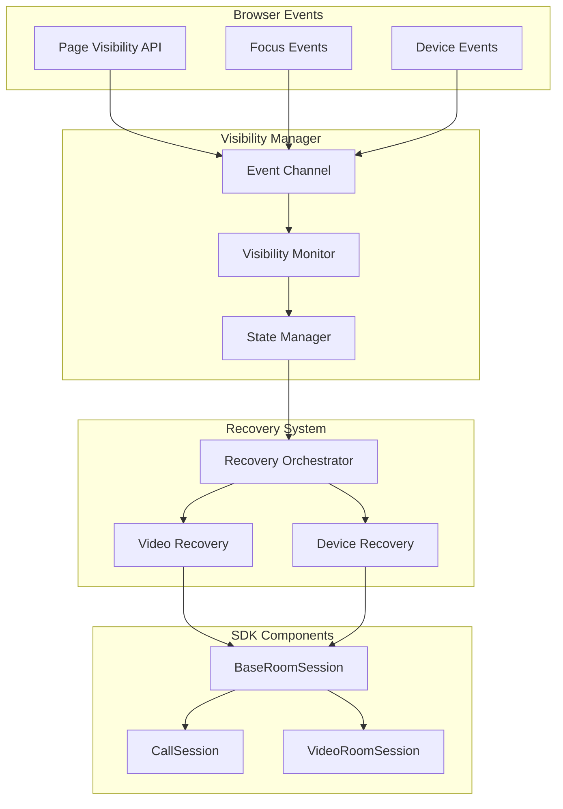
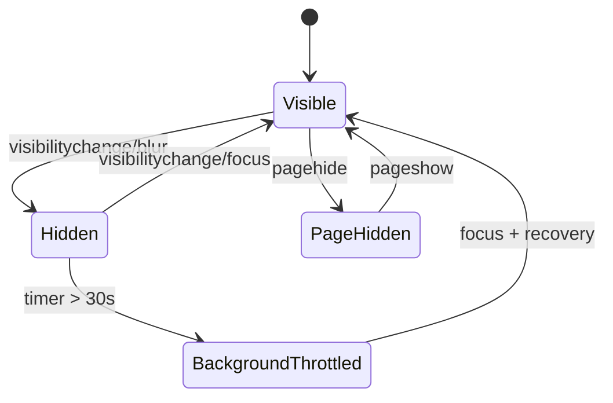

# Visibility & Page Lifecycle Management Specification

## 1. Feature Overview

The Visibility & Page Lifecycle Management feature provides intelligent handling of browser visibility changes, tab focus events, and device wake scenarios to ensure optimal WebRTC performance and resource utilization. This feature is critical for maintaining stable video and audio connections when users switch tabs, minimize browsers, or when mobile devices wake from sleep.

### Key Capabilities

- Automatic video muting/unmuting on mobile during tab switches
- Remote video recovery after visibility restoration
- Device re-enumeration on focus gain
- State preservation across visibility changes
- Graceful handling of browser backgrounding and foregrounding

## 2. Problem Statement

### Current Challenges

#### Mobile Browser Limitations

- **Resource Throttling**: Mobile browsers aggressively throttle background tabs, affecting WebRTC performance
- **Video Stream Interruption**: When tabs lose focus, video streams often freeze or disconnect
- **Audio Sync Issues**: Background tabs may experience audio desynchronization
- **Device Sleep**: Mobile devices entering sleep mode can cause media stream failures

#### Desktop Browser Issues

- **Tab Switching**: Users frequently switch tabs during calls, causing video freezing
- **Window Minimization**: Minimized windows may have reduced priority for media processing
- **Screen Lock**: System screen locks can interrupt WebRTC connections

#### WebRTC-Specific Problems

- **Black Video**: Remote video elements may display black frames after tab restoration
- **Frozen Frames**: Last frame before tab switch remains displayed
- **Lost Keyframes**: Missing I-frames prevent video decoder recovery
- **Device Enumeration**: Media devices may need re-enumeration after wake events

### Impact on Users

- Poor user experience with frozen or black video
- Confusion when video doesn't automatically recover
- Battery drain from unnecessary video transmission when not visible
- Call quality degradation after tab switches

## 3. Proposed Solution

### Core Architecture

The solution implements a multi-layered approach to visibility management:

1. **Visibility Detection Layer**: Monitors browser visibility and focus events
2. **State Management Layer**: Preserves media state across visibility changes
3. **Recovery Strategy Layer**: Implements various recovery mechanisms
4. **Device Management Layer**: Handles device re-enumeration and selection

### Key Components

#### VisibilityManager

Central coordinator for all visibility-related operations, implemented as a saga worker that:

- Monitors Page Visibility API events
- Tracks focus/blur events
- Manages mobile-specific behaviors
- Coordinates recovery strategies

#### MediaStatePreserver

Maintains state of media streams before visibility changes:

- Video mute/unmute state
- Audio mute/unmute state
- Active device selections
- Stream constraints

#### RecoveryOrchestrator

Implements recovery strategies in priority order:

- Video element play() method
- Keyframe request via PLI
- SIP re-INVITE for full reconnection
- Device re-enumeration

## 4. Technical Architecture

### Component Integration



### Worker Architecture

```typescript
// packages/client/src/workers/visibilityWorker.ts
export interface VisibilityWorkerOptions extends SDKWorkerParams {
  instance: BaseRoomSession | CallSession | VideoRoomSession
}

export const visibilityWorker: SDKWorker = function* (
  options: VisibilityWorkerOptions
): SagaIterator {
  const { instance } = options
  const channel = yield call(createVisibilityChannel)

  while (true) {
    const event = yield take(channel)
    yield fork(handleVisibilityEvent, { instance, event })
  }
}
```

## 5. Page Visibility API Integration

### Event Channel Implementation

```typescript
function createVisibilityChannel(): EventChannel<VisibilityEvent> {
  return eventChannel((emitter) => {
    const handleVisibilityChange = () => {
      const state: VisibilityState = {
        hidden: document.hidden,
        visibilityState: document.visibilityState,
        timestamp: Date.now(),
      }
      emitter({ type: 'visibility', state })
    }

    const handleFocus = () => {
      emitter({ type: 'focus', timestamp: Date.now() })
    }

    const handleBlur = () => {
      emitter({ type: 'blur', timestamp: Date.now() })
    }

    const handlePageShow = (event: PageTransitionEvent) => {
      emitter({
        type: 'pageshow',
        persisted: event.persisted,
        timestamp: Date.now(),
      })
    }

    const handlePageHide = (event: PageTransitionEvent) => {
      emitter({
        type: 'pagehide',
        persisted: event.persisted,
        timestamp: Date.now(),
      })
    }

    // Register listeners
    document.addEventListener('visibilitychange', handleVisibilityChange)
    window.addEventListener('focus', handleFocus)
    window.addEventListener('blur', handleBlur)
    window.addEventListener('pageshow', handlePageShow)
    window.addEventListener('pagehide', handlePageHide)

    // Cleanup
    return () => {
      document.removeEventListener('visibilitychange', handleVisibilityChange)
      window.removeEventListener('focus', handleFocus)
      window.removeEventListener('blur', handleBlur)
      window.removeEventListener('pageshow', handlePageShow)
      window.removeEventListener('pagehide', handlePageHide)
    }
  })
}
```

### Visibility State Machine



## 6. Mobile-specific Handling

### Mobile Detection

```typescript
interface MobileContext {
  isMobile: boolean
  isIOS: boolean
  isAndroid: boolean
  browserEngine: 'webkit' | 'blink' | 'gecko'
}

function detectMobileContext(): MobileContext {
  const userAgent = navigator.userAgent.toLowerCase()
  const isIOS = /iphone|ipad|ipod/.test(userAgent)
  const isAndroid = /android/.test(userAgent)
  const isMobile =
    isIOS ||
    isAndroid ||
    'ontouchstart' in window ||
    navigator.maxTouchPoints > 0

  let browserEngine: 'webkit' | 'blink' | 'gecko' = 'blink'
  if ('webkitAudioContext' in window) browserEngine = 'webkit'
  else if ('mozGetUserMedia' in navigator) browserEngine = 'gecko'

  return { isMobile, isIOS, isAndroid, browserEngine }
}
```

### Mobile-Specific Behaviors

#### Auto-mute Strategy

```typescript
function* handleMobileFocusLoss(instance: BaseRoomSession): SagaIterator {
  const mobileContext = yield call(detectMobileContext)
  if (!mobileContext.isMobile) return

  // Store current state
  const videoState = yield select(getVideoMuteState, instance.memberId)
  yield call(saveMediaState, {
    videoMuted: videoState.isMuted,
    audioMuted: videoState.isAudioMuted,
    wasAutoMuted: false,
  })

  // Auto-mute video to save resources
  if (!videoState.isMuted) {
    yield call(instance.muteVideo)
    yield call(saveMediaState, { wasAutoMuted: true })

    // Send DTMF notification to server
    yield call(sendDTMF, instance.id, '*0')
  }
}
```

#### Wake Detection

```typescript
function* detectWakeFromSleep(): SagaIterator {
  let lastCheck = Date.now()

  while (true) {
    yield delay(1000)
    const now = Date.now()
    const timeDiff = now - lastCheck

    // If more than 5 seconds passed, device likely woke from sleep
    if (timeDiff > 5000) {
      yield put({ type: 'DEVICE_WAKE_DETECTED', payload: { timeDiff } })
    }

    lastCheck = now
  }
}
```

## 7. Video Recovery Strategies

### Recovery Priority System

The recovery system implements strategies in order of increasing invasiveness:

```typescript
enum RecoveryStrategy {
  PLAY_VIDEO = 1, // Least invasive - try play() method
  REQUEST_KEYFRAME = 2, // Request new I-frame via PLI
  RECONNECT_STREAM = 3, // Reconnect local stream
  REINVITE = 4, // Most invasive - full renegotiation
}

function* executeRecoveryStrategies(
  instance: BaseRoomSession,
  strategies: RecoveryStrategy[] = [
    RecoveryStrategy.PLAY_VIDEO,
    RecoveryStrategy.REQUEST_KEYFRAME,
    RecoveryStrategy.RECONNECT_STREAM,
    RecoveryStrategy.REINVITE,
  ]
): SagaIterator {
  for (const strategy of strategies) {
    const success = yield call(executeRecoveryStrategy, instance, strategy)
    if (success) {
      yield put({
        type: 'RECOVERY_SUCCESS',
        payload: { strategy: RecoveryStrategy[strategy] },
      })
      return
    }
  }

  // All strategies failed
  yield put({ type: 'RECOVERY_FAILED' })
}
```

### Remote Video Recovery

```typescript
function* checkRemoteVideo(instance: BaseRoomSession): SagaIterator {
  const videoElement = yield call(getVideoElement, instance.id)
  if (!videoElement) return true // No element to check

  const checks = {
    isPaused: videoElement.paused,
    hasNoHeight: videoElement.videoHeight === 0,
    hasNoWidth: videoElement.videoWidth === 0,
    readyState: videoElement.readyState < 2, // HAVE_CURRENT_DATA
  }

  // Check for issues
  if (checks.isPaused) {
    try {
      yield call([videoElement, 'play'])
      yield delay(500) // Wait for play to take effect

      // Recheck
      if (!videoElement.paused && videoElement.videoHeight > 0) {
        return true // Recovery successful
      }
    } catch (error) {
      console.debug('Video play failed:', error)
    }
  }

  // Check for black/frozen frames
  if (checks.hasNoHeight || checks.hasNoWidth || checks.readyState) {
    // Request keyframe
    yield call(requestKeyframe, instance)
    yield delay(1000) // Wait for keyframe

    // Recheck dimensions
    if (videoElement.videoHeight > 0 && videoElement.videoWidth > 0) {
      return true // Recovery successful
    }
  }

  return false // Recovery failed
}
```

### Local Video Recovery

```typescript
function* checkLocalVideo(instance: BaseRoomSession): SagaIterator {
  const localStream = yield call(getLocalStream, instance.id)
  if (!localStream) return true // No stream to check

  const videoTracks = localStream.getVideoTracks()
  if (videoTracks.length === 0) return true // No video tracks

  const track = videoTracks[0]

  // Check track state
  if (!track.enabled || track.muted || track.readyState !== 'live') {
    // Try to reconnect the track
    yield call(reconnectLocalVideoTrack, instance, track)
  }

  // Check local video element
  const overlayElement = yield call(getLocalVideoOverlay, instance.id)
  if (overlayElement && overlayElement.paused) {
    try {
      yield call([overlayElement, 'play'])
    } catch (error) {
      console.debug('Local video play failed:', error)
    }
  }

  return true
}
```

## 8. Device Re-enumeration Logic

### Device Change Detection

```typescript
function* createDeviceMonitorChannel(): EventChannel<DeviceChangeEvent> {
  return eventChannel((emitter) => {
    let previousDevices: MediaDeviceInfo[] = []
    let pollingInterval: NodeJS.Timeout

    const checkDevices = async () => {
      try {
        const devices = await navigator.mediaDevices.enumerateDevices()

        // Detect changes
        const changes = detectDeviceChanges(previousDevices, devices)
        if (changes.length > 0) {
          emitter({ type: 'devices_changed', changes, devices })
        }

        previousDevices = devices
      } catch (error) {
        emitter({ type: 'enumeration_error', error })
      }
    }

    // Initial enumeration
    checkDevices()

    // Setup monitoring
    if ('ondevicechange' in navigator.mediaDevices) {
      navigator.mediaDevices.addEventListener('devicechange', checkDevices)
    } else {
      // Fallback to polling
      pollingInterval = setInterval(checkDevices, 3000)
    }

    // Cleanup
    return () => {
      if ('ondevicechange' in navigator.mediaDevices) {
        navigator.mediaDevices.removeEventListener('devicechange', checkDevices)
      }
      if (pollingInterval) {
        clearInterval(pollingInterval)
      }
    }
  })
}
```

### Device Recovery After Focus

```typescript
function* handleDeviceRecovery(instance: BaseRoomSession): SagaIterator {
  // Re-enumerate devices
  const devices = yield call(enumerateDevices)

  // Get saved device preferences
  const preferences = yield call(getDevicePreferences)

  // Check if preferred devices are still available
  const audioDevice = devices.find(
    (d) => d.deviceId === preferences.audioInput && d.kind === 'audioinput'
  )
  const videoDevice = devices.find(
    (d) => d.deviceId === preferences.videoInput && d.kind === 'videoinput'
  )

  // Reapply devices if changed
  if (!audioDevice && preferences.audioInput) {
    // Preferred audio device lost, use default
    yield call(instance.updateAudioDevice, { deviceId: 'default' })
  }

  if (!videoDevice && preferences.videoInput) {
    // Preferred video device lost, use default
    yield call(instance.updateVideoDevice, { deviceId: 'default' })
  }

  // Verify streams are active
  yield call(verifyMediaStreams, instance)
}
```

## 9. API Design

### Events

```typescript
interface VisibilityEvents {
  // Visibility state changes
  'visibility.changed': (params: {
    state: 'visible' | 'hidden'
    timestamp: number
  }) => void

  // Focus events
  'visibility.focus.gained': (params: {
    wasHidden: boolean
    hiddenDuration: number
  }) => void

  'visibility.focus.lost': (params: { autoMuted: boolean }) => void

  // Recovery events
  'visibility.recovery.started': (params: {
    reason: string
    strategies: string[]
  }) => void

  'visibility.recovery.success': (params: {
    strategy: string
    duration: number
  }) => void

  'visibility.recovery.failed': (params: {
    strategies: string[]
    errors: Error[]
  }) => void

  // Device events
  'visibility.devices.changed': (params: {
    added: MediaDeviceInfo[]
    removed: MediaDeviceInfo[]
  }) => void
}
```

### Configuration

```typescript
interface VisibilityConfig {
  // Enable/disable feature
  enabled: boolean

  // Mobile-specific options
  mobile: {
    autoMuteVideo: boolean // Auto-mute video when losing focus
    autoRestoreVideo: boolean // Auto-unmute when regaining focus
    notifyServer: boolean // Send DTMF notifications
  }

  // Recovery strategies
  recovery: {
    strategies: RecoveryStrategy[] // Strategies to attempt
    maxAttempts: number // Max attempts per strategy
    delayBetweenAttempts: number // Delay in ms
  }

  // Device management
  devices: {
    reEnumerateOnFocus: boolean // Re-enumerate devices on focus
    pollingInterval: number // Polling interval for devices
    restorePreferences: boolean // Restore device preferences
  }

  // Throttling
  throttling: {
    backgroundThreshold: number // Time before throttling (ms)
    resumeDelay: number // Delay before recovery (ms)
  }
}

// Default configuration
const DEFAULT_VISIBILITY_CONFIG: VisibilityConfig = {
  enabled: true,
  mobile: {
    autoMuteVideo: true,
    autoRestoreVideo: true,
    notifyServer: true,
  },
  recovery: {
    strategies: [
      RecoveryStrategy.PLAY_VIDEO,
      RecoveryStrategy.REQUEST_KEYFRAME,
      RecoveryStrategy.RECONNECT_STREAM,
      RecoveryStrategy.REINVITE,
    ],
    maxAttempts: 3,
    delayBetweenAttempts: 1000,
  },
  devices: {
    reEnumerateOnFocus: true,
    pollingInterval: 3000,
    restorePreferences: true,
  },
  throttling: {
    backgroundThreshold: 30000,
    resumeDelay: 200,
  },
}
```

### Public Methods

```typescript
interface VisibilityAPI {
  // Manual control
  pauseForBackground(): Promise<void>
  resumeFromBackground(): Promise<void>

  // State queries
  isBackgrounded(): boolean
  getVisibilityState(): VisibilityState
  getBackgroundDuration(): number

  // Configuration
  updateVisibilityConfig(config: Partial<VisibilityConfig>): void
  getVisibilityConfig(): VisibilityConfig

  // Recovery
  triggerManualRecovery(): Promise<boolean>
  getRecoveryStatus(): RecoveryStatus
}
```

## 10. State Preservation Strategy

### State Management

```typescript
interface MediaStateSnapshot {
  timestamp: number
  video: {
    enabled: boolean
    muted: boolean
    deviceId: string | null
    constraints: MediaTrackConstraints
  }
  audio: {
    enabled: boolean
    muted: boolean
    deviceId: string | null
    constraints: MediaTrackConstraints
  }
  screen: {
    sharing: boolean
    audio: boolean
  }
  autoMuted: {
    video: boolean
    audio: boolean
  }
}

class MediaStateManager {
  private snapshots = new Map<string, MediaStateSnapshot>()

  saveSnapshot(instanceId: string, state: Partial<MediaStateSnapshot>): void {
    const existing =
      this.snapshots.get(instanceId) || this.createDefaultSnapshot()
    this.snapshots.set(instanceId, {
      ...existing,
      ...state,
      timestamp: Date.now(),
    })
  }

  getSnapshot(instanceId: string): MediaStateSnapshot | null {
    return this.snapshots.get(instanceId) || null
  }

  clearSnapshot(instanceId: string): void {
    this.snapshots.delete(instanceId)
  }

  private createDefaultSnapshot(): MediaStateSnapshot {
    return {
      timestamp: Date.now(),
      video: {
        enabled: false,
        muted: true,
        deviceId: null,
        constraints: {},
      },
      audio: {
        enabled: false,
        muted: true,
        deviceId: null,
        constraints: {},
      },
      screen: {
        sharing: false,
        audio: false,
      },
      autoMuted: {
        video: false,
        audio: false,
      },
    }
  }
}
```

### Restoration Process

```typescript
function* restoreMediaState(
  instance: BaseRoomSession,
  snapshot: MediaStateSnapshot
): SagaIterator {
  // Restore video state
  if (
    snapshot.autoMuted.video &&
    snapshot.video.enabled &&
    !snapshot.video.muted
  ) {
    // Was auto-muted, restore if it was previously unmuted
    yield call(instance.unmuteVideo)
    yield call(sendDTMF, instance.id, '*0') // Notify server
  }

  // Restore audio state
  if (
    snapshot.autoMuted.audio &&
    snapshot.audio.enabled &&
    !snapshot.audio.muted
  ) {
    yield call(instance.unmuteAudio)
  }

  // Restore device selections
  if (snapshot.video.deviceId) {
    yield call(instance.updateVideoDevice, {
      deviceId: snapshot.video.deviceId,
    })
  }
  if (snapshot.audio.deviceId) {
    yield call(instance.updateAudioDevice, {
      deviceId: snapshot.audio.deviceId,
    })
  }

  // Restore screen share if it was active
  if (snapshot.screen.sharing) {
    // Note: Screen share typically needs user re-authorization
    yield put({
      type: 'SCREEN_SHARE_RESTORE_NEEDED',
      payload: { hadAudio: snapshot.screen.audio },
    })
  }
}
```

## 11. Testing Strategy

### Unit Tests

```typescript
describe('VisibilityManager', () => {
  describe('Event Detection', () => {
    it('should detect visibility changes', async () => {
      const manager = new VisibilityManager()
      const spy = jest.fn()
      manager.on('visibility.changed', spy)

      // Simulate visibility change
      Object.defineProperty(document, 'hidden', {
        writable: true,
        value: true,
      })
      document.dispatchEvent(new Event('visibilitychange'))

      expect(spy).toHaveBeenCalledWith({
        state: 'hidden',
        timestamp: expect.any(Number),
      })
    })

    it('should detect focus/blur events', async () => {
      const manager = new VisibilityManager()
      const focusSpy = jest.fn()
      const blurSpy = jest.fn()

      manager.on('visibility.focus.gained', focusSpy)
      manager.on('visibility.focus.lost', blurSpy)

      window.dispatchEvent(new Event('blur'))
      expect(blurSpy).toHaveBeenCalled()

      window.dispatchEvent(new Event('focus'))
      expect(focusSpy).toHaveBeenCalled()
    })
  })

  describe('Mobile Behavior', () => {
    it('should auto-mute video on mobile when losing focus', async () => {
      const instance = createMockRoomSession()
      const manager = new VisibilityManager(instance, {
        mobile: { autoMuteVideo: true },
      })

      // Mock mobile detection
      jest.spyOn(manager, 'isMobile').mockReturnValue(true)

      // Simulate focus loss
      await manager.handleFocusLoss()

      expect(instance.muteVideo).toHaveBeenCalled()
      expect(instance.sendDTMF).toHaveBeenCalledWith('*0')
    })
  })

  describe('Recovery Strategies', () => {
    it('should attempt recovery strategies in order', async () => {
      const instance = createMockRoomSession()
      const manager = new VisibilityManager(instance)

      const strategies = [
        jest.fn().mockResolvedValue(false), // Fails
        jest.fn().mockResolvedValue(false), // Fails
        jest.fn().mockResolvedValue(true), // Succeeds
        jest.fn().mockResolvedValue(true), // Should not be called
      ]

      await manager.executeRecoveryStrategies(strategies)

      expect(strategies[0]).toHaveBeenCalled()
      expect(strategies[1]).toHaveBeenCalled()
      expect(strategies[2]).toHaveBeenCalled()
      expect(strategies[3]).not.toHaveBeenCalled()
    })
  })
})
```

### Integration Tests

```typescript
describe('Visibility Integration', () => {
  let page: Page

  beforeEach(async () => {
    page = await browser.newPage()
  })

  it('should handle tab switching', async () => {
    // Setup call
    await page.goto('/test-call')
    await page.waitForSelector('video#remote-video')

    // Switch to new tab
    const newPage = await browser.newPage()
    await newPage.goto('https://example.com')

    // Original tab should detect blur
    await page.waitForFunction(() => document.hidden === true)

    // Switch back
    await page.bringToFront()

    // Should trigger recovery
    await page.waitForFunction(() => {
      const video = document.querySelector('video#remote-video')
      return !video.paused && video.videoHeight > 0
    })
  })

  it('should handle device wake simulation', async () => {
    await page.goto('/test-call')

    // Simulate device wake by injecting time jump
    await page.evaluate(() => {
      const originalNow = Date.now
      let timeOffset = 0
      Date.now = () => originalNow() + timeOffset

      // Simulate 10 second sleep
      setTimeout(() => {
        timeOffset = 10000
        window.dispatchEvent(new Event('focus'))
      }, 100)
    })

    // Should detect wake and recover
    await page.waitForEvent('visibility.recovery.success')
  })
})
```

### E2E Tests

```typescript
describe('E2E Visibility Scenarios', () => {
  it('should maintain call quality through multiple tab switches', async () => {
    const caller = await createTestClient('caller')
    const callee = await createTestClient('callee')

    // Establish call
    const callerSession = await caller.dial(callee.address)
    const calleeSession = await callee.answer()

    // Verify initial state
    expect(callerSession.active).toBe(true)
    expect(calleeSession.active).toBe(true)

    // Simulate tab switches
    for (let i = 0; i < 5; i++) {
      // Hide caller tab
      await simulateTabHide(caller)
      await wait(2000)

      // Show caller tab
      await simulateTabShow(caller)
      await wait(1000)

      // Verify recovery
      const stats = await callerSession.getStats()
      expect(stats.video.framesDecoded).toBeGreaterThan(0)
      expect(stats.video.packetsLost).toBeLessThan(5)
    }
  })
})
```

## 12. Success Metrics

### Performance Metrics

| Metric                        | Target | Measurement Method                                       |
| ----------------------------- | ------ | -------------------------------------------------------- |
| Recovery Success Rate         | > 95%  | Count of successful recoveries / total recovery attempts |
| Recovery Time                 | < 2s   | Time from focus event to video playback                  |
| Auto-mute Accuracy            | 100%   | Correct auto-mute triggers on mobile                     |
| State Restoration Accuracy    | > 98%  | Correctly restored states / total restorations           |
| Device Re-enumeration Success | > 99%  | Successful device detections / total attempts            |

### User Experience Metrics

| Metric                  | Target        | Measurement Method                       |
| ----------------------- | ------------- | ---------------------------------------- |
| Black Screen Duration   | < 500ms       | Time video element shows black frames    |
| Video Freeze Duration   | < 1s          | Time video remains on single frame       |
| User Complaints         | < 1%          | Support tickets related to tab switching |
| Call Drop Rate          | < 0.5%        | Calls dropped due to visibility issues   |
| Battery Impact (Mobile) | < 5% increase | Power consumption with/without feature   |

### Technical Metrics

| Metric                   | Target | Measurement Method                            |
| ------------------------ | ------ | --------------------------------------------- |
| Memory Leak Rate         | 0      | Memory growth over multiple visibility cycles |
| Event Handler Cleanup    | 100%   | Proper removal of all event listeners         |
| DTMF Success Rate        | > 99%  | Successful DTMF transmissions                 |
| Keyframe Request Success | > 90%  | PLI requests resulting in new I-frames        |
| Re-INVITE Success Rate   | > 95%  | Successful SIP re-negotiations                |

### Monitoring Implementation

```typescript
class VisibilityMetrics {
  private metrics = {
    recoveryAttempts: 0,
    recoverySuccesses: 0,
    recoveryFailures: 0,
    recoveryTimes: [],
    autoMuteCount: 0,
    stateRestorations: 0,
    deviceReEnumerations: 0,
    errors: [],
  }

  recordRecoveryAttempt(strategy: string): void {
    this.metrics.recoveryAttempts++
    this.sendTelemetry('recovery.attempt', { strategy })
  }

  recordRecoverySuccess(strategy: string, duration: number): void {
    this.metrics.recoverySuccesses++
    this.metrics.recoveryTimes.push(duration)
    this.sendTelemetry('recovery.success', { strategy, duration })
  }

  recordRecoveryFailure(strategy: string, error: Error): void {
    this.metrics.recoveryFailures++
    this.metrics.errors.push(error)
    this.sendTelemetry('recovery.failure', { strategy, error: error.message })
  }

  getSuccessRate(): number {
    if (this.metrics.recoveryAttempts === 0) return 0
    return (
      (this.metrics.recoverySuccesses / this.metrics.recoveryAttempts) * 100
    )
  }

  getAverageRecoveryTime(): number {
    if (this.metrics.recoveryTimes.length === 0) return 0
    return (
      this.metrics.recoveryTimes.reduce((a, b) => a + b, 0) /
      this.metrics.recoveryTimes.length
    )
  }

  private sendTelemetry(event: string, data: any): void {
    // Send to analytics service
    console.debug(`[Telemetry] ${event}:`, data)
  }
}
```

## Implementation Plan

### Phase 1: Core Infrastructure (Week 1-2)

- Implement VisibilityManager and event channel
- Add visibility worker to BaseRoomSession
- Create MediaStateManager for state preservation
- Add basic unit tests

### Phase 2: Recovery Strategies (Week 2-3)

- Implement video play() recovery
- Add keyframe request mechanism
- Implement stream reconnection
- Add re-INVITE support
- Create recovery orchestrator

### Phase 3: Mobile Optimization (Week 3-4)

- Add mobile detection
- Implement auto-mute/unmute logic
- Add DTMF signaling
- Optimize for battery usage
- Test on iOS/Android devices

### Phase 4: Device Management (Week 4-5)

- Implement device monitoring channel
- Add re-enumeration logic
- Create device preference storage
- Handle device changes during calls
- Test with various USB devices

### Phase 5: Integration & Testing (Week 5-6)

- Integrate with CallSession
- Integrate with VideoRoomSession
- Create comprehensive test suite
- Perform cross-browser testing
- Add telemetry and metrics

### Phase 6: Documentation & Release (Week 6)

- Write developer documentation
- Create migration guide
- Add configuration examples
- Performance optimization
- Production deployment

## Risks and Mitigations

| Risk                          | Impact | Probability | Mitigation                         |
| ----------------------------- | ------ | ----------- | ---------------------------------- |
| Browser API inconsistencies   | High   | Medium      | Feature detection and fallbacks    |
| Performance overhead          | Medium | Low         | Lazy initialization and throttling |
| Breaking existing behavior    | High   | Low         | Feature flag for gradual rollout   |
| Mobile browser limitations    | High   | High        | Progressive enhancement approach   |
| WebRTC renegotiation failures | High   | Low         | Multiple recovery strategies       |
| Memory leaks                  | Medium | Medium      | Proper cleanup and testing         |
| Race conditions               | Medium | Medium      | State machines and locks           |

## Integration with Existing SDK Components

### BaseRoomSession Integration

The visibility management will be integrated into BaseRoomSession as a configurable feature:

```typescript
// packages/client/src/BaseRoomSession.ts
export class BaseRoomSessionConnection extends BaseConnection {
  private visibilityManager?: VisibilityManager

  constructor(options: BaseRoomSessionOptions) {
    super(options)

    if (options.visibilityConfig?.enabled !== false) {
      this.visibilityManager = new VisibilityManager(
        this,
        options.visibilityConfig
      )
    }
  }

  protected override initWorker() {
    super.initWorker()

    if (this.visibilityManager) {
      this.runSaga(visibilityWorker, {
        instance: this,
        channels: this.channels,
      })
    }
  }
}
```

### CallSession Integration

The Call Fabric SDK will inherit visibility management from BaseRoomSession with additional Call Fabric-specific recovery strategies:

```typescript
// packages/client/src/unified/CallSession.ts
export class CallSessionConnection extends BaseRoomSessionConnection {
  protected override getVisibilityConfig(): VisibilityConfig {
    return {
      ...super.getVisibilityConfig(),
      recovery: {
        ...super.getVisibilityConfig().recovery,
        strategies: [
          RecoveryStrategy.PLAY_VIDEO,
          RecoveryStrategy.REQUEST_KEYFRAME,
          RecoveryStrategy.FABRIC_REATTACH, // Call Fabric specific
          RecoveryStrategy.REINVITE,
        ],
      },
    }
  }
}
```

### VideoRoomSession Integration

The Video SDK will use the base visibility management with video-specific optimizations:

```typescript
// packages/client/src/video/VideoRoomSession.ts
export class VideoRoomSessionConnection extends BaseRoomSessionConnection {
  protected override handleVisibilityRecovery(): void {
    super.handleVisibilityRecovery()

    // Video-specific recovery
    if (this.currentLayoutEvent) {
      this.applyLayout(this.currentLayoutEvent)
    }
  }
}
```

## Conclusion

The Visibility & Page Lifecycle Management feature addresses critical issues in WebRTC applications related to browser tab switching and device sleep states. By implementing intelligent detection, state preservation, and recovery strategies, we can significantly improve the user experience and call stability across all platforms, with special attention to mobile devices where these issues are most prevalent.

The layered architecture ensures graceful degradation and progressive enhancement, while the comprehensive testing strategy ensures reliability. The metrics and monitoring system will provide insights for continuous improvement and help identify edge cases in production.

This feature will establish SignalWire SDK as a leader in handling real-world WebRTC challenges, providing developers with a robust solution that "just works" across all scenarios users encounter in their daily usage.
